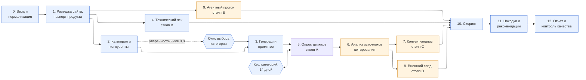
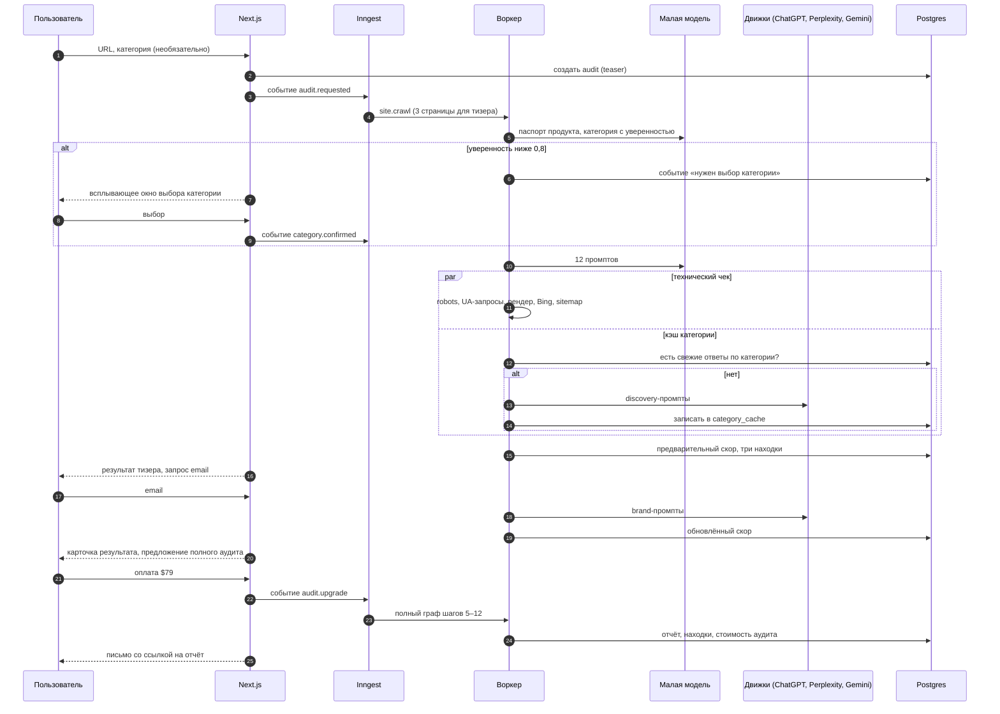

# Geotrack — скоуп MVP, скоуп полного сервиса, архитектура и план работ

Дата: 2026-09-03. Версия 1.1. Проект: GEO. Автор: Serghey (ProDuck:t Space) при участии Claude. Связанные документы: GEOTRACK_PRODUCT_CONCEPT_RU.md, GEOTRACK_SALES_STRATEGY_RU.md, GEOTRACK_AUDIT_METHODOLOGY_RU.md.

## Резюме

Документ фиксирует два скоупа — MVP на 10 недель, который можно тестировать на реальных клиентах и показывать инвесторам, и полный сервис на 9–12 месяцев после MVP, — и для каждого описывает техническую архитектуру, стек и план работ по этапам. Схемы архитектуры лежат в папке `diagrams` (SVG и PNG), граф шагов и последовательность аудита встроены в текст как Mermaid.

**Ключевые предположения**:
- Команда разработки: Serghey как продакт-менеджер и Claude Code как разработчик; наёмных разработчиков, DevOps и дизайнера нет. Скорость определяется временем продакта на постановку задач, проверку результата и тесты на реальных сайтах.
- Стек: TypeScript на всём пути (Next.js, Node-воркеры, Playwright), чтобы один язык покрывал фронт, API и пайплайн аудита, а Claude Code работал в одном контексте без переключения языков.
- MVP автоматизирует тизер и платный аудит по столпам A, B, C и частично D и E; полноценный агентный прогон, мониторинг, агентский тариф и API — после MVP.

**Рекомендация**: строить MVP как один монорепозиторий с двумя сервисами (веб-приложение и воркер аудита) на управляемой инфраструктуре без Kubernetes; показывать инвесторам не демо, а метрики с 50–100 реальных аудитов.

**Статус**: готово к использованию как план разработки, оценки трудозатрат — версия 1.0.

---

## 1. Скоуп MVP

### 1.1 Цель MVP

Проверить три гипотезы и получить цифры для инвесторов: бесплатный тизер конвертирует в платный аудит не хуже 5%, платный аудит признают полезным (NPS отчёта, повторные обращения), хотя бы одна услуга из корзины исправлений покупается. Всё, что не нужно для проверки этих гипотез, из MVP исключается.

### 1.2 Что входит

| Блок | Входит в MVP | Комментарий |
|---|---|---|
| Лендинг и ввод | Поле URL, необязательные поля категории и конкурентов, всплывающее окно выбора категории, экран прогресса с живой лентой | Без регистрации до результата |
| Бесплатный тизер | Столп B полностью, столп A на 12 промптах и одном движке (Perplexity), критерий E5, предварительный скор, три шаблонные находки, шареабельная карточка | Email-гейт перед brand-промптами |
| Платный аудит | Столп A: 30 промптов, три движка (ChatGPT, Perplexity, Gemini), два повтора; столп B; столп C на 10 страницах; столп D по критериям D1, D2, D4 через поисковые API; столп E по критериям E2–E5 автоматически, E1 — скриптовые сценарии «найти цену» и «начать регистрацию» | Без Copilot и Claude как движков, без полноценного LLM-агента |
| Скоринг | Все веса и правила блокеров из методологии, доверительный интервал, общий бенчмарк по SaaS | Бенчмарк по категории — после 20 аудитов в категории |
| Отчёт | Веб-отчёт по ссылке, PDF, до 15 находок в формате семи полей, корзина исправлений с прогнозом скора | Экспорт в Notion и Linear — после MVP |
| Оплата | Разовый платёж $79 и $199 через merchant of record (Paddle или Lemon Squeezy) | Stripe недоступен для компаний из Молдовы напрямую |
| Upsell | Три услуги в корзине: AI Crawl Fix, Citable Content Pack, Entity Kit; оплата или заявка через форму и Cal.com | Исполнение вручную |
| Кэш категорий | Хранение ответов движков по категориям на 14 дней, переиспользование в тизере | Главный рычаг себестоимости |
| Локализация | Интерфейс, отчёт, письма и промпты на английском и румынском (next-intl, локаль в паспорте продукта и наборе промптов) | Закладывается в неделю 0 |
| Админка | Список аудитов, просмотр артефактов, ручная проверка отчёта перед отправкой, повторный запуск шага, стоимость каждого аудита | Минимальный интерфейс |
| Письма | Результат тизера, готовность отчёта, письмо через сутки с одной находкой | Три шаблона |
| Аналитика | Воронка тизер, email, оплата, открытие отчёта, клик по услуге | Продуктовая аналитика и ошибки |

### 1.3 Что не входит

Подписка на мониторинг и планировщик прогонов; агентский тариф, мультипроектность и white-label; публичный API; полноценный LLM-агент для столпа E; движки Copilot и Claude; Wikidata и Wikipedia в столпе D; маркетплейс исполнителей и партнёрский портал; интеграции с Notion, Linear, Jira, Slack; командные аккаунты и роли; языки кроме английского и румынского.

### 1.4 Что показываем инвесторам

Не демо, а цифры: количество тизеров и платных аудитов, конверсии по воронке, себестоимость аудита против цены, три-пять кейсов с ре-аудитом после услуги, бенчмарки по двум категориям как доказательство данных, список ожидания на мониторинг. Демо-сценарий — живой аудит сайта инвестора за две минуты.

---

## 2. Скоуп полного сервиса

Полный сервис — то, что описано в концепции продукта, доведённое до автоматизации и масштабирования.

| Блок | Полный сервис |
|---|---|
| Аудит | Все 29 критериев, пять движков плюс AI Overviews и AI Mode, три повтора, бенчмарки по категориям, локальные рынки и языки |
| Агентный слой | Прогон сценариев LLM-агентом в облачном браузере, проверка MCP, WebMCP, ACP и UCP, Web Bot Auth, тест-прогон чекаута для коммерции |
| Мониторинг | Еженедельные прогоны по расписанию, динамика скора и share of voice, алерты об изменениях и обгоне конкурентами, ежемесячный ре-аудит |
| Конкурентная разведка | Разбор источников цитирования конкурентов, план перехвата, изменения в формулировках движков |
| Отчёты и интеграции | Веб, PDF, white-label, экспорт задач в Notion, Linear, Jira, алерты в Slack и email |
| Аккаунты | Организации, роли, несколько проектов, агентский тариф, партнёрский кабинет |
| Услуги | Каталог 15 сервисных продуктов, корзина, заказ, статусы исполнения, ре-аудит после услуги, выплаты партнёрам-исполнителям |
| Биллинг | Разовые платежи, подписки Monitor Starter, Growth, Scale, агентские планы, usage-based API |
| API и встраивание | Публичный REST API, вебхуки, виджет чекера для хостингов и no-code платформ |
| Данные | Хранилище ответов и цитат по категориям, карта источников, бенчмарки по категориям, эксперименты с весами |
| Операции | Админ-консоль, контроль стоимости на аудит, роутер моделей с fallback, наблюдаемость, инцидент-процесс |
| Соответствие | Регион данных ЕС, политика хранения, DPA для клиентов, путь к SOC 2 |

---

## 3. Архитектура MVP

### 3.1 Принципы

1. Два сервиса, один репозиторий: веб-приложение на Next.js и воркер аудита на Node с Playwright. Всё остальное — управляемые сервисы.
2. Пайплайн аудита — набор шагов оркестратора с повторами и параллельностью, а не один длинный процесс. Каждый шаг идемпотентен и пишет артефакты в базу.
3. Провайдеры движков и моделей спрятаны за адаптерами. Замена Perplexity на другой движок или Gemini Flash на DeepSeek — изменение конфигурации, а не кода пайплайна.
4. Все стоимости считаются: каждый вызов модели и движка записывает токены и цену в контексте аудита.
5. Никакого Kubernetes и собственных серверов: Vercel, Railway, Supabase, Upstash.

### 3.2 Стек

| Слой | Выбор | Почему |
|---|---|---|
| Фронт и API | Next.js 15 (App Router), TypeScript, Tailwind, shadcn/ui, хостинг Vercel | Один фреймворк для лендинга, отчёта, админки и API-роутов |
| Оркестрация шагов | Inngest | Шаги с повторами, fan-out, задержки и события без своей очереди; функции живут в коде воркера |
| Воркер аудита | Node 22, TypeScript, Docker на Railway или Fly.io | Playwright и долгие задачи не живут в serverless |
| Краулинг | Playwright (Chromium), undici для сырых запросов с подменой user-agent, cheerio и @mozilla/readability для разбора HTML, robots-parser | Сырой HTML и рендер сравниваются для критерия B3 |
| Модели | Vercel AI SDK с провайдерами Google (Gemini Flash как малая модель), OpenAI, Anthropic; OpenRouter как запасной путь; схемы Zod для структурированного вывода | Единый интерфейс, смена модели конфигурацией |
| Движки для столпа A | OpenAI Responses API с инструментом web_search (ChatGPT), Perplexity Sonar API, Gemini API с grounding через Google Search | Официальные API, без скрейпинга интерфейсов |
| Поиск для B4 и D | SerpAPI или DataForSEO (проверка индекса Bing, поиск профилей на G2, Capterra, Product Hunt, упоминаний на Reddit) | Bing Search API закрыт для новых клиентов; агрегаторы дают Bing-выдачу |
| База данных | Supabase Postgres, Drizzle ORM, Row Level Security для отчётов по ссылке | Управляемый Postgres с auth и storage в одном месте |
| Auth | Supabase Auth, magic link | Email-гейт тизера и есть регистрация |
| Файлы | Supabase Storage (скриншоты ответов, HTML-снимки, PDF) | Достаточно для MVP; на масштабе — Cloudflare R2 |
| Кэш и лимиты | Upstash Redis: rate limit по IP и домену, блокировки повторных запусков; кэш категорий — таблица в Postgres с TTL | Кэш должен быть запрашиваемым, поэтому в Postgres |
| Платежи | Paddle или Lemon Squeezy (merchant of record), вебхуки в Next.js | Налоги и доступность для компании из Молдовы |
| Письма | Resend, шаблоны React Email | Три шаблона MVP |
| PDF | Playwright print страницы отчёта в воркере | Один и тот же React-отчёт для веба и PDF |
| Аналитика и ошибки | PostHog (события воронки), Sentry (ошибки), Langfuse (трассировка и стоимость вызовов моделей) | Стоимость на аудит видна с первого дня |
| Защита | Cloudflare Turnstile на форме, лимит один тизер на домен в 30 дней, секреты в переменных окружения | Защита от прогона всего интернета через наш счёт |
| Репозиторий и CI | GitHub, pnpm workspaces (apps/web, apps/worker, packages/core), GitHub Actions: lint, типы, тесты, деплой | Пакет core содержит скоринг, схемы и адаптеры, общие для обоих сервисов |

### 3.3 Компоненты

**Веб-приложение (apps/web).** Лендинг с формой, экран прогресса (подписка на события аудита через Server-Sent Events из Postgres-таблицы событий), страница результата тизера, страница отчёта по токену, страница оплаты, админка за Supabase Auth с ролью admin, API-роуты: создание аудита, вебхуки платежей, экспорт PDF. Локализация через next-intl: английский и румынский для интерфейса, отчёта и писем.

**Воркер аудита (apps/worker).** HTTP-сервис, регистрирующий функции Inngest. Одна функция-оркестратор `audit.run` и функции шагов: `site.crawl`, `product.passport`, `category.detect`, `prompts.generate`, `tech.check`, `engines.poll`, `sources.analyze`, `content.analyze`, `offsite.collect`, `agent.scripted`, `score.compute`, `findings.build`, `report.render`. Оркестратор запускает шаги по зависимостям: 4 параллельно с 5; 6 после 5; 7 и 8 параллельно после 6; 9 параллельно с 5–8; 10–12 после всех. Каждый шаг проверяет, есть ли уже результат в базе, и не считает повторно.

**Пакет core (packages/core).** Схемы данных (Zod и Drizzle), конфигурация весов и порогов версии 1.0 в JSON, чистые функции скоринга, шаблоны находок, адаптеры движков и моделей с единым интерфейсом `ask(prompt) -> {text, sources, usage}`, учёт стоимости.

**Данные.** Основные таблицы: `audits` (статус, тип тизер или полный, стоимость, версия методологии), `sites` и `pages` (снимки HTML, метрики страниц), `passports`, `categories` (таксономия), `competitors`, `prompts`, `engine_runs` (движок, промпт, повтор, полный текст, источники, usage), `mentions` (бренд, позиция, тональность, извлечённые утверждения), `tech_checks`, `offsite_signals`, `agent_runs`, `scores` (по критериям и столпам), `findings`, `orders` и `payments`, `category_cache` (категория, промпт, движок, ответ, срок годности), `audit_events` (лента прогресса), `users`.

**Кэш категорий.** Перед шагом 5 оркестратор проверяет, есть ли в `category_cache` свежие ответы на discovery-, comparison- и problem-led-промпты категории. Есть — берёт из кэша, запрашивает только brand-промпты. Нет — запрашивает всё и пишет в кэш. Бенчмарки категорий и разборы для аутрича читают ту же таблицу.

### 3.4 Схема MVP

Исходник схемы — `diagrams/gen_arch.py`, растровая копия — `diagrams/GEOTRACK_ARCH_MVP.png`.

Граф шагов пайплайна (синим — шаги тизера, оранжевым — только платный аудит):

### 3.5 Последовательность аудита

### 3.6 Технические нюансы MVP

- **Движки через официальные API.** Ответы OpenAI с web_search и Perplexity Sonar не тождественны интерфейсам ChatGPT и Perplexity; это указывается в отчёте. Скрейпинг интерфейсов не используется.
- **Идемпотентность шагов.** Ключ шага — `audit_id + step + version`. Повтор шага не дублирует записи; результат перезаписывается только при явном перезапуске из админки.
- **Лимиты провайдеров.** Очередь к каждому движку ограничивается конкурентностью (Inngest concurrency по ключу провайдера); при 429 — экспоненциальная задержка, при недоступности провайдера — шаг помечается «частично», аудит не падает.
- **Структурированный вывод.** Все ответы малой модели валидируются схемой Zod; при ошибке — один повтор с указанием ошибки, затем запасной провайдер.
- **Стоимость.** Каждый вызов пишет `usage` и цену по прайс-таблице провайдера; лимит стоимости на аудит (например, $8) прерывает пайплайн с пометкой.
- **Наш краулер.** Представляется как `GeotrackBot`, уважает robots.txt для себя, но для критериев B1 и B2 делает запросы с user-agent AI-ботов — это проверка, а не обход; ограничение 1 запрос в секунду на домен.
- **Приватность.** Данные клиента не уходят в официальный API DeepSeek; малые модели — Gemini Flash или американские провайдеры через OpenRouter. Отчёт по ссылке с токеном в 32 байта, без индексации.
- **Отказоустойчивость PDF.** PDF генерируется отложенно после отчёта, ссылка появляется в письме, а не блокирует показ.

---

## 4. Архитектура полного сервиса

### 4.1 Что меняется по сравнению с MVP

Монолитный воркер разделяется на пулы по типу нагрузки; появляются расписание и мониторинг; ответы движков и цитаты становятся аналитическим хранилищем; появляются организации, роли, API и биллинг подписок; агентный прогон переезжает в облачный браузер с LLM-агентом; добавляются регион данных ЕС и наблюдаемость уровня продакшена.

### 4.2 Стек полного сервиса

| Слой | Выбор | Изменение относительно MVP |
|---|---|---|
| Фронт | Next.js, тот же дизайн-система, добавляются кабинет организации, дашборд мониторинга, партнёрский кабинет | Расширение |
| API | Отдельный сервис API на Hono или NestJS с OpenAPI-спецификацией, ключи API, вебхуки | Новый сервис |
| Оркестрация | Temporal (Temporal Cloud) для долгих и расписанных рабочих процессов: аудит, мониторинг, ре-аудит, исполнение услуг | Замена Inngest, когда появляются расписания и процессы на дни |
| Воркеры | Пулы: crawler (Crawlee и Playwright), engine-poller (лимиты по провайдерам), extractor (модели), agent-runner (Browserbase и Stagehand или computer-use API), offsite-collector, renderer | Разделение по нагрузке и масштабирование независимо |
| Роутер моделей | Собственный слой поверх AI SDK: выбор модели по задаче, стоимость, fallback, канареечные сравнения, eval-набор из 50 сайтов | Новый компонент |
| OLTP | Postgres (Supabase или Neon), регион ЕС | Тот же, с регионом |
| Аналитика | ClickHouse (ClickHouse Cloud): engine_runs, mentions, citations, временные ряды скоров, бенчмарки | Новый компонент |
| Объектное хранилище | Cloudflare R2 | Замена Storage |
| Очереди и кэш | Redis (Upstash), Kafka не нужен | Тот же |
| Поиск и данные | DataForSEO, SerpAPI, Reddit API, Wikidata SPARQL, Crunchbase при наличии лицензии | Расширение |
| Биллинг | Paddle подписки и usage-based; выплаты партнёрам через Paddle или Wise Business | Расширение |
| Интеграции | Notion, Linear, Jira, Slack через OAuth-приложения; экспорт CSV | Новое |
| Feature flags | PostHog flags | Новое |
| Наблюдаемость | OpenTelemetry, Grafana Cloud или Axiom, Sentry, Langfuse, дашборд стоимости на аудит | Расширение |
| Инфраструктура | Railway или Fly.io для воркеров, Vercel для фронта, Terraform для управляемых сервисов; Kubernetes — только если воркеров станет больше 20 | Без преждевременного усложнения |
| Безопасность | SSO для организаций, аудит-лог, шифрование секретов, DPA-шаблон, политика хранения 12 месяцев, путь к SOC 2 Type 1 | Новое |

### 4.3 Схема полного сервиса

Растровая копия — `diagrams/GEOTRACK_ARCH_FULL.png`.

### 4.4 Технические нюансы полного сервиса

- **Мониторинг как отдельный поток данных.** Еженедельный прогон пишет в ClickHouse; дашборд и алерты читают оттуда, Postgres хранит только текущие скоры. Алерт — событие Temporal, доставляется в Slack, email и вебхук.
- **Агентный прогон.** LLM-агент в облачном браузере с записью трассы, скриншотов и точки отказа; бюджет шагов на сценарий (30), таймаут (3 минуты), запрет на платёжные шаги. Прогон только по подтверждённому владению доменом (DNS-запись или meta-тег).
- **Роутер моделей и eval.** Каждая задача извлечения имеет золотой набор из 50 размеченных примеров; смена модели проходит через eval и канареечный запуск на 10% трафика; стоимость и точность видны в админ-консоли.
- **Мультитенантность.** Организации, проекты, роли owner, admin, member, partner; RLS в Postgres; агентский тариф — организация с дочерними проектами и white-label настройками.
- **Публичный API.** Версионирование по пути, ключи с квотами, идемпотентные запросы создания аудита, вебхуки с подписью.
- **Хранение и удаление.** Артефакты 12 месяцев, удаление по запросу клиента, регион ЕС для всех хранилищ, DPA для клиентов из ЕС.
- **Стоимость на масштабе.** Кэш категорий с TTL 14 дней и приоритет пакетных API для мониторинга (задержка допустима); лимиты стоимости на аудит и на организацию.

---

## 5. План работ MVP — 10 недель

Команда: Serghey как продакт-менеджер и Claude Code как разработчик. Оценки — в календарных неделях при 20–25 часах продакта в неделю на продукт (постановка задач, проверка, тесты на реальных сайтах, калибровка); продажи и контент — отдельным бюджетом времени из стратегии продаж.

### 5.1 Как организована работа с Claude Code

Разработчик без человека в паре требует другой дисциплины, чем найм. Шесть правил, которые держат темп и качество:

1. **Спецификация до кода.** Каждая задача начинается с короткого файла в `docs/specs/`: что делаем, входы и выходы, критерий приёмки, что не делаем. Claude Code читает спецификацию, а не пересказ в чате. Документы GEO (методология, архитектура) лежат в репозитории и являются источником истины.
2. **CLAUDE.md в репозитории.** Соглашения проекта: структура монорепозитория, стек, правила именования, как запускать тесты и миграции, что нельзя менять без спецификации (веса скоринга, схемы данных, адаптеры). Обновляется после каждого этапа.
3. **Тесты как приёмка.** Для каждого шага пайплайна — фикстуры: сохранённые HTML трёх-пяти сайтов, сохранённые ответы движков, ожидаемые результаты скоринга. Задача считается закрытой, когда тесты проходят и продакт проверил результат на живом сайте. Без тестов регрессии при следующих изменениях неизбежны.
4. **Маленькие задачи, частые коммиты.** Одна задача — один шаг пайплайна или один экран, не больше двух-трёх часов работы. Ветка на задачу, pull request с описанием, CI зелёный до слияния. Продакт читает diff и описание, а не весь код.
5. **Продакт владеет данными и промптами.** Таксономия категорий, шаблоны находок, промпты для малой модели, веса — это файлы конфигурации, которые продакт правит сам без участия разработчика. Так калибровка не ждёт цикла разработки.
6. **Еженедельный ритуал.** В конце недели: прогон полного аудита на трёх эталонных сайтах, сравнение с прошлой неделей, обновление CLAUDE.md и спецификаций, план следующей недели из таблицы этапов.

Слабые места этой модели и что с ними делать: отладка внешних API и продакшен-инцидентов требует человека, который читает логи — продакт должен уметь открыть Sentry и Langfuse и передать контекст Claude Code; безопасность и секреты проверяются по чек-листу перед каждым деплоем; архитектурные решения фиксируются в `docs/adr/` короткими записями, чтобы Claude Code не переизобретал их в следующих сессиях.

### 5.2 Этапы

| Этап | Недели | Что делаем | Результат и критерий приёмки |
|---|---|---|---|
| 0. Фундамент | 1 | Монорепозиторий, Next.js с next-intl (en, ro), Supabase, Inngest, воркер в Docker на Railway, CI, Sentry, PostHog, Langfuse; схема данных v1 с полем локали; адаптеры движков и малой модели с учётом стоимости | Пустой аудит проходит через оркестратор от события до записи в базу; стоимость вызова видна в Langfuse |
| 1. Понять продукт | 2 | Краулер (3 и 50 страниц), паспорт продукта, таксономия категорий (200 записей), детекция категории с уверенностью и всплывающим окном, детекция конкурентов, генератор промптов | На 20 тестовых сайтах категория верна в 85% случаев без окна; промпты проходят ручную проверку фаундером |
| 2. Факты дёшево | 3 | Технический чек B1–B6 (robots, UA-запросы, рендер без JS, Bing через SerpAPI, sitemap, свежесть); правила блокеров; кэш категорий; опрос Perplexity; парсинг упоминаний и позиций; предварительный скор | Тизер собирается за минуту и стоит меньше $0,1 на втором сайте категории; результаты B воспроизводимы дважды |
| 3. Тизер наружу | 4 | Лендинг, форма с Turnstile, экран прогресса с лентой событий, страница результата, три шаблонные находки, шареабельная карточка, email-гейт через magic link, письмо результата, лимиты по домену | Первые 30 тизеров на сайтах из личной сети; воронка видна в PostHog |
| 4. Полный аудит: столп A и C | 5–6 | ChatGPT и Gemini адаптеры, 30 промптов, два повтора, доверительный интервал, точность описания A5, тональность A6; анализ источников цитирования; контент-анализ C1–C6 на 10 страницах со сравнением с цитируемыми страницами | На пяти эталонных сайтах скор и находки согласованы с ручным аудитом фаундера |
| 5. Полный аудит: столп D и E | 6–7 | D1, D2, D4 через SerpAPI; E2 аудит доступности (axe-core), E3 барьеры, E4 машиночитаемые данные, E5 манифесты; E1 скриптовые сценарии «найти цену» и «начать регистрацию» в Playwright | Все столпы дают баллы и артефакты; аудит целиком укладывается в 6 минут и $6 |
| 6. Находки, отчёт, оплата | 7–8 | Генератор находок в формате семи полей, приоритизация, корзина исправлений с прогнозом скора, веб-отчёт по токену, PDF, оплата через Paddle или Lemon Squeezy с вебхуками, три услуги в корзине, письма готовности и через сутки | Оплаченный аудит доставляется автоматически; фаундер проверяет отчёт в админке перед отправкой |
| 7. Калибровка и бенчмарки | 9 | Прогон 50 сайтов в двух категориях, правка весов и порогов, шаблонов находок; бенчмарки категорий в отчёте; проверка румынской версии интерфейса, отчёта и промптов на пяти сайтах; страница методологии для доверия; юридические страницы и политика данных | Разброс скора при повторном прогоне в пределах интервала; румынская версия проходит ручную проверку |
| 8. Бета и материалы | 10 | 20 concierge-клиентов из личной сети, сбор обратной связи, исправления; демо-сценарий для инвесторов, дашборд метрик воронки и себестоимости, кейсы | Метрики за две недели беты, три кейса, готовый демо-скрипт на две минуты |

Итого: 10 календарных недель при 20–25 часах продакта в неделю. Код пишется быстро, узкое место — проверка результата на реальных сайтах и калибровка, поэтому этапы 1, 2 и 7 нельзя ускорить за счёт скорости генерации кода. Резерв на риски — две недели: чаще всего задерживают адаптеры движков (лимиты, изменения API), калибровка и внешние сервисы (платёжный провайдер, лимиты API).

Риски плана: изменение API или цен движков (адаптеры и бюджет на аудит), качество детекции категории (всплывающее окно как страховка), нестабильность парсинга источников из ответов (тесты на золотом наборе), задержка с платёжным провайдером (заявка в Paddle подаётся на неделе 1), накопление технического долга без человеческого ревью (тесты, CI, ADR и еженедельный прогон эталонных сайтов как компенсация).

---

## 6. План работ полного сервиса — 9–12 месяцев после MVP

Команда после MVP: та же связка продакт плюс Claude Code до появления выручки; первый найм — не разработчик, а человек на операции услуг и поддержку клиентов (этап 5). Инженер с опытом продакшена нужен на этапах 3 и 7 (агентный слой, наблюдаемость, регион данных, SOC 2) — там цена ошибки без человеческого ревью выше всего; до этого его можно заменить разовыми консультациями. С этой поправкой сроки этапов ниже сохраняются, но этапы 3 и 7 стоит считать с запасом в 30%.

| Этап | Месяцы | Что делаем | Результат |
|---|---|---|---|
| 1. Мониторинг и подписки | 1–3 | Temporal вместо Inngest, расписания прогонов, ClickHouse для временных рядов, дашборд динамики скора и share of voice, алерты в email и Slack, подписки Monitor Starter, Growth, Scale через Paddle, кабинет пользователя с проектами, экспорт в Notion и Linear | Рекуррентная выручка, первые 10 подписок |
| 2. Полнота аудита | 2–4 | Движки Copilot и Claude, AI Overviews и AI Mode через партнёрские данные, столп D полностью (D3, D5, Wikidata), локальные рынки и языки, бенчмарки по категориям из накопленных данных | Скор сопоставим с методологией 1.0 целиком |
| 3. Агентный слой | 4–6 | LLM-агент в Browserbase со Stagehand, четыре сценария, трассы и скриншоты, проверки MCP, WebMCP, ACP, UCP, Web Bot Auth, подтверждение владения доменом; услуги MCP Server Build и Agent UX Fix в каталоге | Столп E автоматизирован, дифференциатор в продукте |
| 4. Роутер моделей и качество | 4–6 | Золотые наборы для всех задач извлечения, eval-харнесс, канареечные запуски, сравнение Gemini Flash и DeepSeek через американского провайдера, дашборд стоимости и точности | Себестоимость тизера $0,05–0,10, полного аудита ниже $3 |
| 5. Услуги и партнёры | 5–8 | Каталог 15 услуг, заказ и статусы, ре-аудит после услуги, партнёрский кабинет, выплаты партнёрам, отчёт об эффекте услуги | Attach rate услуг измерим, партнёры-исполнители подключены |
| 6. Агентства и API | 7–10 | Организации и роли, агентский тариф, white-label отчёты и домены, публичный API с ключами и квотами, вебхуки, встраиваемый виджет чекера | Канал агентств и первые встраивания |
| 7. Соответствие и операции | 8–12 | Регион данных ЕС, политика хранения, DPA, аудит-лог, SSO, OpenTelemetry и Grafana, инцидент-процесс, подготовка к SOC 2 Type 1 | Продажи mid-market без блокеров по безопасности |
| 8. Данные как актив | 10–12 | Карта источников по категориям, конкурентная разведка как продукт, эксперименты с весами на исторических данных, отчёты по индустрии | Competitive Intelligence и бенчмарки как отдельные продукты |

Порядок этапов задан выручкой: сначала подписки (рекуррентность), затем полнота и агентный слой (дифференциация), затем услуги, агентства и API (масштаб), и параллельно — соответствие требованиям для выхода в mid-market.

---

## 7. Выводы

MVP — это два сервиса на управляемой инфраструктуре и один язык, десять недель работы фаундера с одним разработчиком, автоматизирующие тизер и платный аудит по всем пяти столпам с упрощениями в D и E. Его задача — не впечатлить демо, а принести инвесторам цифры воронки, себестоимости и кейсы. Полный сервис вырастает из той же кодовой базы заменой оркестратора, разделением воркеров, добавлением аналитического хранилища, агентного слоя, подписок, организаций и API — без переписывания ядра скоринга и адаптеров.

Следующий шаг — заявка в Paddle, создание монорепозитория и неделя 0 плана.

---

**Статус**: готово к использованию, оценки трудозатрат — версия 1.0  
**Последнее обновление**: 2 сентября 2026  
**Следующий пересмотр**: после недели 4 плана MVP
