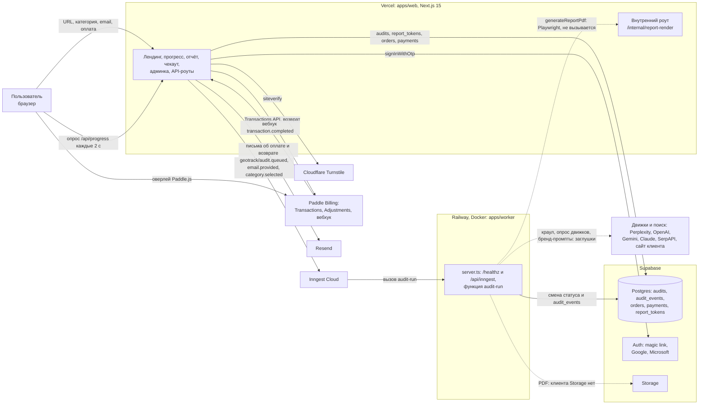
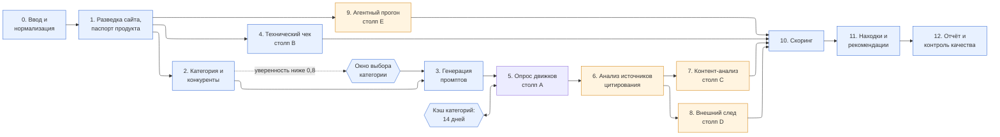
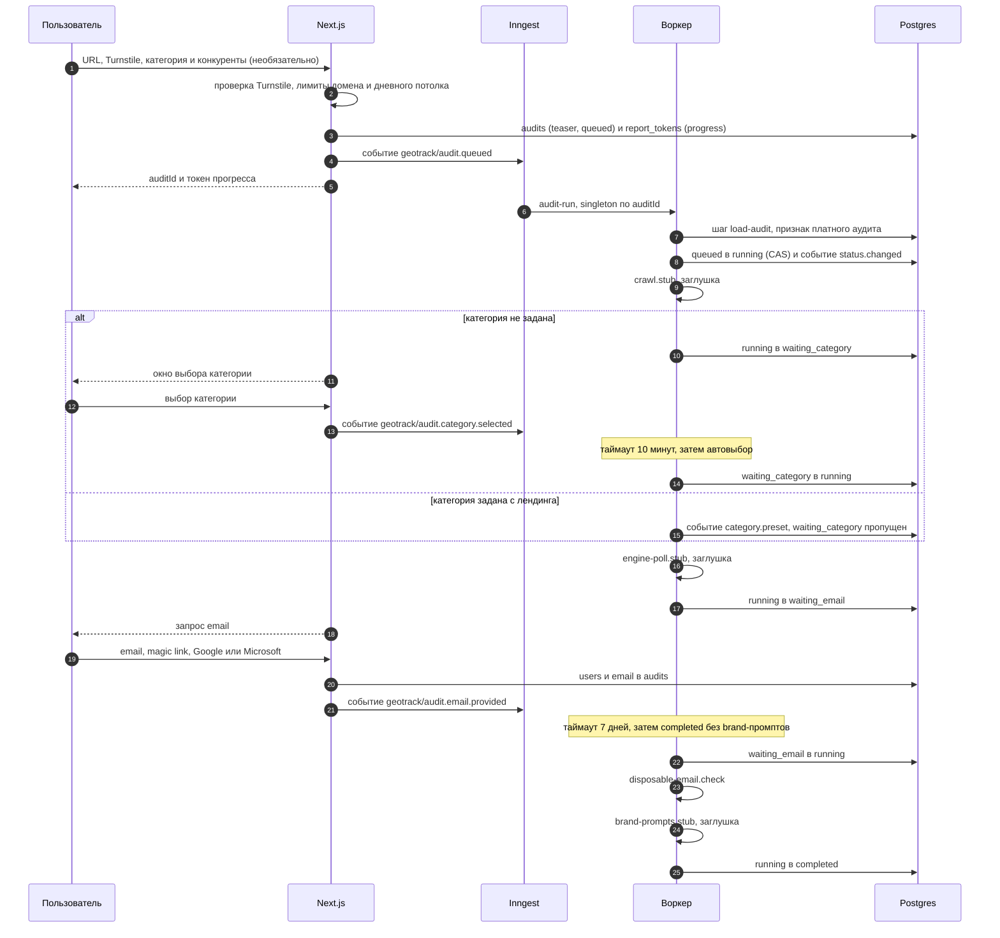
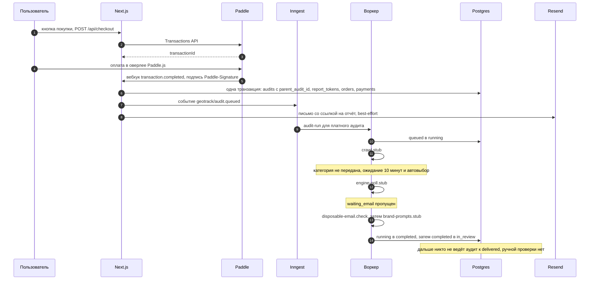

# Geotrack — скоуп MVP, скоуп полного сервиса, архитектура и план работ

Дата: 2026-09-03. Версия 1.1. Проект: GEO. Автор: Serghey (ProDuck:t Space) при участии Claude. Связанные документы: GEOTRACK_PRODUCT_CONCEPT_RU.md, GEOTRACK_SALES_STRATEGY_RU.md, GEOTRACK_AUDIT_METHODOLOGY_RU.md. Обновлено 2026-10-03: архитектурные разделы отражают реализацию до T-79 и результаты независимого код-ревью (см. резюме).

## Резюме

Документ фиксирует два скоупа — MVP на 10 недель, который можно тестировать на реальных клиентах и показывать инвесторам, и полный сервис на 9–12 месяцев после MVP, — и для каждого описывает техническую архитектуру, стек и план работ по этапам. Схема архитектуры MVP, граф шагов и последовательность аудита встроены в текст как Mermaid (исправлено: исходная ссылка на папку `diagrams` с SVG и PNG вела в пустоту — такой папки в репозитории нет; ссылка на неё в разделе 4.3 для схемы полного сервиса сохранена).

**Ключевые предположения**:
- Команда разработки: Serghey как продакт-менеджер и Claude Code как разработчик; наёмных разработчиков, DevOps и дизайнера нет. Скорость определяется временем продакта на постановку задач, проверку результата и тесты на реальных сайтах.
- Стек: TypeScript на всём пути (Next.js, Node-воркеры, Playwright), чтобы один язык покрывал фронт, API и пайплайн аудита, а Claude Code работал в одном контексте без переключения языков.
- MVP автоматизирует тизер и платный аудит по столпам A, B, C и частично D и E; полноценный агентный прогон, мониторинг, агентский тариф и API — после MVP.

**Рекомендация**: строить MVP как один монорепозиторий с двумя сервисами (веб-приложение и воркер аудита) на управляемой инфраструктуре без Kubernetes; показывать инвесторам не демо, а метрики с 50–100 реальных аудитов.

**Обновление 2026-10-03.** Архитектурные разделы (1.2, 3.2–3.7, 5.2) приведены в соответствие с реально построенной системой: они отражают реализацию до T-79 включительно и результаты независимого код-ревью 2026-10-02 (PR #54–#62). Исходный текст сохранён там, где он остаётся верным; всё, что изменилось по факту, помечено «исправлено». Сводка состояния по компонентам — подраздел 3.7. Скоуп полного сервиса (разделы 2, 4, 6) и методология не менялись.

**Главный вывод обновления**: контуры вокруг пайплайна построены и работают на sandbox-окружении — приём аудита, лимиты, статусы и ожидания, оркестрация с защитой от сбоя и дублей, оплата через Paddle, веб-отчёт по токену, PDF-рендер, админка, деплой. Сами шаги пайплайна — нет: модули краулера, опроса движков, скоринга и находок написаны и протестированы на фикстурах, но оркестратор `audit-run` вызывает вместо них три заглушки (`crawlStub`, `enginePollStub`, `brandPromptsStub`). Платный аудит поэтому проходит все статусы до `in_review` с пустым содержимым. Реальные платежи включать нельзя, пока заглушки не заменены настоящими шагами (раздел 5.2).

**Обновление 2026-10-03 (DataForSEO).** Продакт решил 2026-10-03: ответы движков и поисковые проверки планируется получать через одного вендора — DataForSEO (LLM Scraper для ответов движков, SERP-методы вместо SerpAPI). Причина — стоимость: она критична для MVP. Решение зафиксировано в ADR-027 (статус «предложено», статус «принято» ставит продакт) и в техплане версии 1.9. В коде на дату правки реализации нет: адаптера DataForSEO в репозитории не существует, построены четыре адаптера прямых API провайдеров (Perplexity, ChatGPT, Gemini, Claude) и два шага с SerpAPI. Поэтому разделы 3.2, 3.3, 3.6 и 3.7 описывают DataForSEO как **планируемый** источник, а фактическое состояние сохранено рядом; устаревшие места помечены «исправлено в 1.9».

**Статус**: готово к использованию как план разработки, оценки трудозатрат — версия 1.0. Архитектурные разделы обновлены 2026-10-03 по состоянию репозитория.

---

## 1. Скоуп MVP

### 1.1 Цель MVP

Проверить три гипотезы и получить цифры для инвесторов: бесплатный тизер конвертирует в платный аудит не хуже 5%, платный аудит признают полезным (NPS отчёта, повторные обращения), хотя бы одна услуга из корзины исправлений покупается. Всё, что не нужно для проверки этих гипотез, из MVP исключается.

### 1.2 Что входит

Столбец «Состояние на 2026-10-03» добавлен при обновлении и сверен с репозиторием; столбцы «Входит в MVP» и «Комментарий» — исходная постановка с исправлениями там, где построено иначе. Условные обозначения состояния: «готово» — работает в приложении; «готово, не подключено» — модуль написан и протестирован на фикстурах, но оркестратор его не вызывает; «заглушка» — оркестратор вызывает пустой шаг; «не начато» — кода нет.

| Блок | Входит в MVP | Комментарий | Состояние на 2026-10-03 |
|---|---|---|---|
| Лендинг и ввод | Поле URL, необязательные поля категории и конкурентов, всплывающее окно выбора категории, экран прогресса с живой лентой | Без регистрации до результата | Готово (T-21, T-22). Категория, заданная на лендинге, пропускает определение категории и ожидание выбора. Список конкурентов уходит в событие `audit.queued`, воркер его пока не читает |
| Бесплатный тизер | Профиль `teaser` (`packages/config/src/audit-profiles.v2.json`): 3 страницы краулера, один движок (Perplexity), 10 категорийных и 2 брендовых промпта, один повтор; столп B, предварительный столп A, критерий E5, три шаблонные находки, шареабельная карточка. Потолок стоимости $0,10 мягкий и $0,25 жёсткий | Email-гейт перед brand-промптами | Интерфейс и гейт готовы (T-21–T-26). Расчёт тизера — заглушка: в оркестраторе нет ни краула, ни опроса движка, ни brand-промптов |
| Платный аудит | Профиль `standard` ($79): краулер до 50 страниц, четыре движка (Perplexity, ChatGPT, Gemini, Claude), 20 категорийных, 4 брендовых и 6 клиентских промптов, два повтора, три конкурента; все столпы, до 15 находок, ручная проверка, PDF; потолок $6 мягкий и $8 жёсткий. Столп C на 10 страницах; столп D по D1, D2, D4 через SerpAPI; столп E: E1 — скриптовые сценарии, E2–E5 автоматически. Профиль `extended` ($199): три локали, 30+10+10 промптов, пять конкурентов | Без Copilot и без полноценного LLM-агента. Исправлено: Claude включён четвёртым движком платных профилей (ADR-024, T-78); в исходной редакции были три движка и 30 промптов | Модули шагов и скоринга готовы, не подключены. Платный аудит проходит статусы до `in_review` с пустым содержимым (раздел 3.5) |
| Скоринг | Все веса и правила блокеров из методологии, доверительный интервал, общий бенчмарк по SaaS | Бенчмарк по категории — после 20 аудитов в категории | Функции столпов A–E, итога и интервала готовы (T-16, T-20, T-35, T-36, T-40), не подключены. Два решения продакта приняты, но не реализованы: блокер столпа B по движкам и счёт share of voice в A4 вхождениями (раздел 3.7). Расхождение весов столпов между текстом методологии и `methodology.v1.json` — открыто, у продакта. Бенчмарк не начат |
| Отчёт | Веб-отчёт по ссылке, PDF, до 15 находок в формате семи полей, корзина исправлений с прогнозом скора | Экспорт в Notion и Linear — после MVP | Веб-отчёт по токену (T-43), генератор находок (T-41), прогноз корзины (T-42) и PDF (T-44) построены. PDF не вызывается из пайплайна, а клиента для сохранения файла в Supabase Storage нет. Отчёт читает таблицы `scores`, `findings`, `tech_checks` и другие, в которые пайплайн пока ничего не пишет |
| Оплата | Разовый платёж $79 и $199 через Paddle как merchant of record (ADR-007) | Stripe недоступен для компаний из Молдовы напрямую. Исправлено: исходно «Paddle или Lemon Squeezy»; Lemon Squeezy остаётся запасным вариантом и не реализован | Готово на sandbox (T-45): Transactions API, оверлей Paddle.js, вебхук, возврат из админки; контракт возврата прогнан вживую против sandbox. Кнопка покупки есть только у тарифа Standard. Боевой аккаунт Paddle — после юридических страниц (T-51) |
| Upsell | Три услуги в корзине: AI Crawl Fix, Citable Content Pack, Entity Kit; оплата или заявка через форму и Cal.com | Исполнение вручную | Не начато: в коде есть расчёт прогноза корзины (T-42), но нет ни покупки услуг, ни формы заявки |
| Кэш категорий | Хранение ответов движков по категориям на 14 дней, переиспользование в тизере | Главный рычаг себестоимости | Таблица `category_cache`, модуль с TTL 14 дней и запретом на брендовые и клиентские промпты (T-17, ADR-021) готовы, не подключены |
| Локализация | Интерфейс, отчёт, письма и промпты на английском и румынском (next-intl, локаль в паспорте продукта и наборе промптов) | Закладывается в неделю 0. Исправлено: модель локалей принята как «язык плюс рынок» (ADR-019), промпты генерируются на языке локали, не переводятся | Построены канонические наборы промптов: 200 категорий на двух локалях (T-14a). Интерфейс — только английский: next-intl не подключён, локаль аудита зафиксирована как `en`. Справочника локалей из ADR-019 в коде пока нет |
| Админка | Список аудитов, просмотр артефактов, ручная проверка отчёта перед отправкой, повторный запуск шага, стоимость каждого аудита | Минимальный интерфейс | Готово частично (T-09, #54): список с фильтром по статусу, карточка аудита (стоимость, события, прогоны движков), возврат платежа. Вход — общий `ADMIN_SECRET`, а не Supabase Auth. Кнопка Restart только пишет событие и ничего не перезапускает. Ручной проверки и перехода `in_review → delivered` нет (T-47 не начата) |
| Письма | Результат тизера, готовность отчёта, письмо через сутки с одной находкой | Три шаблона | Работают: magic link (отправляет Supabase Auth), «оплата получена» и «возврат» через Resend (ADR-026). Три исходных шаблона — T-46, не начата |
| Аналитика | Воронка тизер, email, оплата, открытие отчёта, клик по услуге | Продуктовая аналитика и ошибки | Не начато: PostHog, Sentry и Langfuse вынесены из T-00 решением продакта 2026-10-01 в отдельную будущую задачу |

**Что реально работает на заглушках.** Построена и проверена цепочка «аудит принят — статус ведётся в базе — ожидания категории и email — завершение или отказ». Не работают, оставаясь модулями без вызова из оркестратора: краулер и технический чек, опрос четырёх движков и извлечение упоминаний, анализ источников и контента, внешний след, сценарии столпа E, скоринг, находки, PDF. Пока заглушки не заменены, ни тизер, ни платный аудит не производят данных для отчёта.

### 1.3 Что не входит

Подписка на мониторинг и планировщик прогонов; агентский тариф, мультипроектность и white-label; публичный API; полноценный LLM-агент для столпа E; движок Copilot (исправлено: Claude включён в платные профили четвёртым движком, ADR-024); Wikidata и Wikipedia в столпе D; маркетплейс исполнителей и партнёрский портал; интеграции с Notion, Linear, Jira, Slack; командные аккаунты и роли; языки кроме английского и румынского.

### 1.4 Что показываем инвесторам

Не демо, а цифры: количество тизеров и платных аудитов, конверсии по воронке, себестоимость аудита против цены, три-пять кейсов с ре-аудитом после услуги, бенчмарки по двум категориям как доказательство данных, список ожидания на мониторинг. Демо-сценарий — живой аудит сайта инвестора за две минуты.

---

## 2. Скоуп полного сервиса

Полный сервис — то, что описано в концепции продукта, доведённое до автоматизации и масштабирования.

| Блок | Полный сервис |
|---|---|
| Аудит | Все 29 критериев, пять движков плюс AI Overviews и AI Mode, три повтора, бенчмарки по категориям, локальные рынки и языки |
| Агентный слой | Прогон сценариев LLM-агентом в облачном браузере, проверка MCP, WebMCP, ACP и UCP, Web Bot Auth, тест-прогон чекаута для коммерции |
| Мониторинг | Еженедельные прогоны по расписанию, динамика скора и share of voice, алерты об изменениях и обгоне конкурентами, ежемесячный ре-аудит |
| Конкурентная разведка | Разбор источников цитирования конкурентов, план перехвата, изменения в формулировках движков |
| Отчёты и интеграции | Веб, PDF, white-label, экспорт задач в Notion, Linear, Jira, алерты в Slack и email |
| Аккаунты | Организации, роли, несколько проектов, агентский тариф, партнёрский кабинет |
| Услуги | Каталог 15 сервисных продуктов, корзина, заказ, статусы исполнения, ре-аудит после услуги, выплаты партнёрам-исполнителям |
| Биллинг | Разовые платежи, подписки Monitor Starter, Growth, Scale, агентские планы, usage-based API |
| API и встраивание | Публичный REST API, вебхуки, виджет чекера для хостингов и no-code платформ |
| Данные | Хранилище ответов и цитат по категориям, карта источников, бенчмарки по категориям, эксперименты с весами |
| Операции | Админ-консоль, контроль стоимости на аудит, роутер моделей с fallback, наблюдаемость, инцидент-процесс |
| Соответствие | Регион данных ЕС, политика хранения, DPA для клиентов, путь к SOC 2 |

---

## 3. Архитектура MVP

### 3.1 Принципы

1. Два сервиса, один репозиторий: веб-приложение на Next.js и воркер аудита на Node с Playwright. Всё остальное — управляемые сервисы.
2. Пайплайн аудита — набор шагов оркестратора с повторами и параллельностью, а не один длинный процесс. Каждый шаг идемпотентен и пишет артефакты в базу.
3. Провайдеры движков и моделей спрятаны за адаптерами. Замена Perplexity на другой движок или Gemini Flash на DeepSeek — изменение конфигурации, а не кода пайплайна.
4. Все стоимости считаются: каждый вызов модели и движка записывает токены и цену в контексте аудита.
5. Никакого Kubernetes и собственных серверов: Vercel, Railway, Supabase, Inngest Cloud (исправлено: Upstash из исходного плана не подключён, лимиты считаются запросами к Postgres).

### 3.2 Стек

Столбцы «Выбор» и «Почему» — исходный план; столбец «Факт на 2026-10-03» сверен с `package.json`, кодом и ADR. Где построено иначе, стоит пометка «исправлено».

| Слой | Выбор | Почему | Факт на 2026-10-03 |
|---|---|---|---|
| Фронт и API | Next.js 15 (App Router), TypeScript, Tailwind, shadcn/ui, хостинг Vercel | Один фреймворк для лендинга, отчёта, админки и API-роутов | Next.js 15, React 19, Vercel с Root Directory `apps/web`. Исправлено: Tailwind и shadcn/ui не используются — страницы переносятся 1:1 из эталонного HTML (правило CLAUDE.md), стили — CSS-переменные `globals.css` и inline-стили |
| Оркестрация шагов | Inngest | Шаги с повторами, fan-out, задержки и события без своей очереди; функции живут в коде воркера | Inngest Cloud. Единственная функция `audit-run` зарегистрирована в воркере (`/api/inngest`), веб только отправляет события. Локально — Inngest Dev Server (`INNGEST_DEV=1`, в production не задавать) |
| Воркер аудита | Node 22, TypeScript, Docker на Railway или Fly.io | Playwright и долгие задачи не живут в serverless | Railway, Docker (`apps/worker/Dockerfile`, `railway.json`, healthcheck `/healthz`); Fly.io не используется. Запуск через `tsx`, а не голый `node` (раздел 3.6). Образ вживую не собирался |
| Краулинг | Playwright (Chromium), undici для сырых запросов с подменой user-agent, cheerio и @mozilla/readability для разбора HTML, robots-parser | Сырой HTML и рендер сравниваются для критерия B3 | Playwright ^1.63 с двумя фабриками контекстов (ADR-015, ADR-025), сырые запросы — через `safe-fetch` на undici. Исправлено: cheerio, @mozilla/readability и robots-parser не подключены — robots.txt разбирает собственный модуль по RFC 9309, текст из HTML извлекает собственный однопроходный разборщик. axe-core в зависимостях нет: шаг E2 получает результаты через внедряемую функцию `checkPage`, её реализации (Playwright плюс axe) в коде пока нет |
| Модели | Vercel AI SDK с провайдерами Google (Gemini Flash как малая модель), OpenAI, Anthropic; OpenRouter как запасной путь; схемы Zod для структурированного вывода | Единый интерфейс, смена модели конфигурацией | Исправлено: AI SDK и OpenRouter не используются. Адаптеры написаны на сыром `fetch` с внедряемым `fetch` (тот же принцип у Paddle и Resend, ADR-026); малая модель — Gemini Flash (`GeminiModelAdapter`), схемы Zod — как в плане. Реестр движков и моделей — `engines.v1.json`, цены — `provider-prices.v1.json` |
| Движки для столпа A | OpenAI Responses API с инструментом web_search (ChatGPT), Perplexity Sonar API, Gemini API с grounding через Google Search | Официальные API, без скрейпинга интерфейсов | Четыре адаптера в `packages/core`: Perplexity Sonar, ChatGPT (Responses API, `web_search_preview`), Gemini (grounding), Claude (Messages API с веб-поиском, Haiku 4.5, `max_uses: 1`, ADR-024). Ни один не вызывается из воркера с реальным ключом. Исправлено в 1.9: «официальные API, без скрейпинга интерфейсов» перестало быть целевым решением — ответы движков планируется получать через DataForSEO LLM Scraper (ADR-027, статус «предложено»); реализации нет, адаптера DataForSEO в коде нет |
| Поиск для B4 и D | SerpAPI или DataForSEO (проверка индекса Bing, поиск профилей на G2, Capterra, Product Hunt, упоминаний на Reddit) | Bing Search API закрыт для новых клиентов; агрегаторы дают Bing-выдачу | SerpAPI (шаги `tech-check` и `offsite-signals` принимают ключ параметром); DataForSEO не используется. Ключ SerpAPI передаётся в query string — открыто (блок D в `debt.md`). Планируется (ADR-027): поисковые проверки переходят на SERP-методы DataForSEO, SerpAPI заменяется; цена поискового запроса DataForSEO не проверена |
| База данных | Supabase Postgres, Drizzle ORM, Row Level Security для отчётов по ссылке | Управляемый Postgres с auth и storage в одном месте | Supabase Postgres (регион Европа, ADR-002), Drizzle ORM 0.36, драйвер `postgres`, 20 таблиц и пять миграций 0000–0004. Исправлено: политик RLS в схеме и миграциях нет — доступ к отчёту ограничивает токен на уровне приложения (ADR-006: 32 байта, в базе хэш), а приложение ходит в базу серверным соединением `DATABASE_URL` |
| Auth | Supabase Auth, magic link | Email-гейт тизера и есть регистрация | Supabase Auth для email-гейта: magic link (`signInWithOtp`), Google и Microsoft (ADR-018), обработчик `/api/auth/callback`. Исправлено: админка за Supabase Auth не стоит — вход по общему секрету `ADMIN_SECRET` в cookie, без личности администратора |
| Файлы | Supabase Storage (скриншоты ответов, HTML-снимки, PDF) | Достаточно для MVP; на масштабе — Cloudflare R2 | Не подключено: в воркере есть только интерфейс `StorageClient`, реализации нет. Видимость бакета для PDF — открытый вопрос до подключения (`debt.md`, T-44) |
| Кэш и лимиты | Upstash Redis: rate limit по IP и домену, блокировки повторных запусков; кэш категорий — таблица в Postgres с TTL | Кэш должен быть запрашиваемым, поэтому в Postgres | Исправлено: Upstash и Redis не подключены. Лимит «один тизер на домен за 30 дней» и дневной потолок `FREE_DAILY_CEILING` считаются запросами к Postgres; счётчики по IP — заглушка, всегда возвращают 0; повторный запуск одного аудита блокирует `singleton` Inngest. Кэш категорий — таблица `category_cache` |
| Платежи | Paddle или Lemon Squeezy (merchant of record), вебхуки в Next.js | Налоги и доступность для компании из Молдовы | Paddle Billing (ADR-007). `POST /api/checkout` создаёт транзакцию, оплата идёт в оверлее Paddle.js (`@paddle/paddle-js`, `NEXT_PUBLIC_PADDLE_CLIENT_TOKEN`), вебхук `/api/webhooks/paddle`, возврат — Adjustments API. Sandbox и production различаются по префиксу ключа. Пока подключён только sandbox |
| Письма | Resend, шаблоны React Email | Три шаблона MVP | Resend через сырой `fetch` (ADR-026). Исправлено: React Email не используется, шаблоны — HTML-строки; реализованы два (оплата, возврат). Подтверждение домена отправки — шаг чек-листа продакта, адрес отправителя зашит в код (`debt.md`) |
| PDF | Playwright print страницы отчёта в воркере | Один и тот же React-отчёт для веба и PDF | Playwright печатает внутренний роут `/internal/report-render/[auditId]` (доступ по `AUDIT_SERVICE_KEY`, ADR-025). Исправлено: общий пакет `packages/ui` пуст (`export {}`), веб-отчёт и PDF — два отдельных компонента (`report-content.tsx`, `report-pdf-content.tsx`) над одними таблицами базы |
| Аналитика и ошибки | PostHog (события воронки), Sentry (ошибки), Langfuse (трассировка и стоимость вызовов моделей) | Стоимость на аудит видна с первого дня | Не подключены (решение продакта 2026-10-01, T-00). Учёт стоимости реализован в коде (`packages/core/src/cost`, потолки в профилях), панели нет |
| Защита | Cloudflare Turnstile на форме, лимит один тизер на домен в 30 дней, секреты в переменных окружения | Защита от прогона всего интернета через наш счёт | Turnstile используется: виджет на лендинге (`@marsidev/react-turnstile`) и серверная проверка siteverify в `POST /api/audits` (без `TURNSTILE_SECRET_KEY` проверка пропускается — режим разработки). Служебный ключ `AUDIT_SERVICE_KEY` обходит Turnstile и лимиты (внутренние аудиты). Секреты — в переменных окружения: 17 обязательных у веба и 2 у воркера (`INNGEST_SIGNING_KEY`, `DATABASE_URL`) проверяются на старте, у веба — ещё и на сборке |
| Репозиторий и CI | GitHub, pnpm workspaces (apps/web, apps/worker, packages/core), GitHub Actions: lint, типы, тесты, деплой | Пакет core содержит скоринг, схемы и адаптеры, общие для обоих сервисов | pnpm 9.15.9 закреплён в `packageManager`, ставится через corepack (голого `pnpm` в PATH может не быть — `corepack pnpm`). Пакеты: `apps/web`, `apps/worker`, `packages/core`, `config`, `db`, `ui`. CI: lint, typecheck, test и сборка `apps/web` с фиктивными env; тест `env-list-sync.test.ts` сверяет списки обязательных переменных в четырёх местах (`env.ts`, `check-env.mjs`, `ci.yml`, `.env.example`). Исправлено: деплой не шаг CI — Vercel и Railway собирают сами по пушу |
| Локальная среда | — | — | `pnpm dev`, Inngest Dev Server, `.env.local` вне репозитория. Вебхуки Paddle на локальную машину приходят через публичный туннель (ADR-007, поправка 2026-10-01; конкретный инструмент — cloudflared quick tunnel, по сведениям продакта, в репозитории не зафиксирован) — только для разработки, в production не используется |

**Планируемое изменение стека 2026-10-03: DataForSEO (ADR-027, статус «предложено»).** Две строки таблицы — «Движки для столпа A» и «Поиск для B4 и D» — меняются по решению продакта. Ответы движков планируется брать у DataForSEO (LLM Scraper, у скрейпера два движка: ChatGPT и Gemini), поисковые проверки — у его же SERP-методов вместо SerpAPI. Причина — стоимость: цена результата LLM Scraper, по странице цен вендора, $0,0012 в очереди, $0,0024 в приоритетной очереди и $0,004 в живом режиме. Это изменение защищённого списка внешних провайдеров и ключей (инвариант CLAUDE.md): требуется явное согласие продакта в описании PR. Что ничего из этого не построено: в репозитории нет ни файла адаптера DataForSEO, ни упоминания вендора в коде и конфигурации (проверено 2026-10-03; единственные упоминания — в документах и в `playbook/integrations.md`, где DataForSEO назван запасным вариантом SerpAPI). Подробности отличий скрейпера от прямых API — раздел 3.6, состояние — раздел 3.7.

### 3.3 Компоненты

**Веб-приложение (apps/web).** Лендинг с формой и виджетом Turnstile; экран прогресса — исправлено: клиент опрашивает `/api/progress` каждые 2 секунды с `after_seq`, а не подписывается на Server-Sent Events (ADR-016); окно выбора категории (`/api/audits/[id]/candidates`, `/category`); email-гейт (`/api/audits/[id]/email`, `/api/auth/callback`); страница результата тизера; страница отчёта по токену (платные отчёты закрыты report-токеном, тизер открыт по `auditId` — он защищён лимитами, ADR-018); чекаут (`/api/checkout` плюс оверлей Paddle.js); вебхук платежей (`/api/webhooks/paddle`); админка (`/admin`: список по статусам, карточка аудита, возврат и Restart, маршруты `/api/admin/...`, страницы в route-группе `admin/(panel)`, middleware на Node.js runtime); внутренний роут `/internal/report-render/[auditId]` для PDF. Исправлено: локализация через next-intl не подключена, интерфейс английский; админка защищена общим `ADMIN_SECRET`, а не Supabase Auth с ролью. Веб только отправляет события в Inngest (`geotrack/audit.queued`, `geotrack/audit.email.provided`, `geotrack/audit.category.selected`); точки приёма Inngest в вебе нет.

**Воркер аудита (apps/worker).** Первая реальная HTTP-точка входа — `server.ts` на `node:http`: `/healthz` для Railway и обработчик Inngest (`/api/inngest`). Регистрирует одну функцию `audit-run`; её `onFailure` Inngest ведёт как отдельную функцию `audit-run-failure`, поэтому после каждого деплоя, где менялись функции, приложение нужно заново синхронизировать в Inngest Cloud. Исправлено: шаги — не отдельные функции Inngest с именами `site.crawl`, `engines.poll` и т.д., а модули с внедряемыми зависимостями в `apps/worker/src/steps` и `packages/core/src/steps`; оркестратор `audit-run` пока вызывает только три заглушки и проверку disposable-email. Соответствие плану:

| Шаг плана | Модуль | Состояние |
|---|---|---|
| `site.crawl` | `steps/crawl.ts` (robots.txt по RFC 9309, очередь на хост `net/host-gate.ts`) | Готово, не подключено; в оркестраторе — `crawlStub` |
| `product.passport`, `category.detect`, конкуренты | `product-passport.ts`, `category-detect.ts`, `competitor-detect.ts` | Готово, не подключено |
| `prompts.generate` | `generatePromptBundle` в `packages/config` | Готово, не подключено (шаг `prompts.client` не реализован) |
| `tech.check` | `tech-check.ts`, скор — `core/scoring/pillar-b.ts` | Готово, не подключено |
| `engines.poll` | `engine-poll.ts`, `extract-mentions.ts`, `accuracy-check.ts`, `tone-check.ts`; кэш — `cache/` | Готово, не подключено; в оркестраторе — `enginePollStub` и `brandPromptsStub` |
| `sources.analyze` | `source-map.ts` | Готово, не подключено |
| `content.analyze` | `content-check.ts`, `cited-pages.ts` | Готово, не подключено |
| `offsite.collect` | `offsite-signals.ts` | Готово, не подключено |
| `agent.scripted` | `agent-scenario-check.ts`, `accessibility-check.ts`, `machine-readable-check.ts` | Готово, не подключено; `checkPage` (Playwright и axe) не реализован |
| `score.compute`, `findings.build` | `packages/core/src/scoring`, `findings` | Готово в `core`, не вызывается |
| `report.render` | `steps/report-pdf.ts` | Готово, не вызывается; сохранения файла нет |

**Пакет core (packages/core).** Схемы и контракты (`Step<I,O>`, `EngineAdapter` с методом `ask`, `ModelAdapter`), конфигурация весов и порогов в `packages/config/src/methodology.v1.json`, чистые функции скоринга и находок, адаптеры четырёх движков и малой модели Gemini Flash, учёт стоимости, `safe-fetch` и проверка IP, таблица переходов статусов `audit-status.ts` (ADR-012), токены отчёта и прогресса, лимиты бесплатного потока, проверка одноразовых адресов. Границы пакетов (`core` не зависит от `web` и `worker`) и запрет на импорт `undici` и `playwright` мимо `safe-fetch` и фабрик Playwright проверяет ESLint.

**Данные.** В схеме 20 таблиц: `users`, `audits` (статус, тип `teaser`, `standard` или `extended`, `parent_audit_id`, профиль и его версия, `is_internal`, стоимость, версия методологии), `audit_events` (лента прогресса, уникальная пара `audit_id` и `seq`), `orders`, `payments`, `report_tokens` (хэши токенов отчёта и прогресса), `category_cache`, `sites`, `pages`, `passports`, `categories`, `competitors`, `prompts`, `engine_runs`, `mentions`, `tech_checks`, `offsite_signals`, `agent_runs`, `scores`, `findings`. Исправлено относительно плана: добавлена таблица `report_tokens`, которой в исходном списке не было. Сегодня приложение пишет только `users`, `audits`, `audit_events`, `orders`, `payments`, `report_tokens`; остальные таблицы пайплайн заполнит после замены заглушек. Миграции — drizzle-kit, пять файлов, единый путь применения `pnpm db:migrate` (раздел 3.6).

**Кэш категорий.** Перед опросом движков оркестратор должен проверять, есть ли в `category_cache` свежие ответы на категорийные промпты. Реализован модуль с ключом `(категория, локаль, версия набора, промпт, движок, повтор)` и TTL 14 дней; брендовые и клиентские промпты в кэш не попадают — попытка бросает `BrandedPromptCacheError` (ADR-021); сбой чтения кэша считается промахом. К пайплайну кэш не подключён: опрос движков заглушен.

**Планируемый источник ответов движков и поисковых данных (решено 2026-10-03, не реализовано).** Сегодня компонент, который добывает ответы движков, — это четыре адаптера прямых API провайдеров в `packages/core/src/adapters` (`perplexity.ts`, `chatgpt.ts`, `gemini.ts`, `claude.ts`, плюс `gemini-model.ts` для малой модели) и шаг `engine-poll.ts`, принимающий адаптеры как внедряемый параметр. Поисковые данные добывают два шага воркера, `tech-check.ts` и `offsite-signals.ts`, оба через SerpAPI. По решению продакта этот состав заменяется одним внешним источником — DataForSEO: LLM Scraper для ответов движков, SERP-методы для поисковых проверок (ADR-027, статус «предложено»). Следствия для компонентов, которые придётся менять: интерфейс `EngineAdapter` в `packages/core/src/contracts/engine.ts` — инвариант CLAUDE.md, его метод сегодня `ask(prompt, { timeoutMs, locale })` и не знает ни режима исполнения, ни кода региона; кэш категорий — ключ и набор хранимых полей ответа; реестр движков `engines.v1.json` и прайс-таблица `provider-prices.v1.json`. Судьба четырёх существующих адаптеров и SerpAPI не решена — открытый вопрос в ADR-027. Код по этому решению не менялся: в репозитории на 2026-10-03 адаптера DataForSEO нет.

### 3.4 Схема MVP

Исправлено: исходная редакция ссылалась на растровую и векторную схему в папке `diagrams`; такой папки в репозитории нет. Схема ниже построена по коду и ADR и заменяет ссылку. Сплошные стрелки работают сегодня, пунктирные — модуль или интеграция написаны, но в пайплайне не задействованы (заглушка или нет клиента).

```mermaid
flowchart LR
  U["Пользователь<br/>браузер"]
  TURN["Cloudflare Turnstile"]
  PAD["Paddle Billing:<br/>Transactions, Adjustments, вебхук"]
  RES["Resend"]
  INN["Inngest Cloud"]
  EXT["Движки и поиск: Perplexity, OpenAI,<br/>Gemini, Claude, SerpAPI, сайт клиента"]

  subgraph VERCEL["Vercel: apps/web, Next.js 15"]
    WEB["Лендинг, прогресс, отчёт, чекаут,<br/>админка, API-роуты"]
    RR["Внутренний роут<br/>/internal/report-render"]
  end

  subgraph RAILWAY["Railway, Docker: apps/worker"]
    WRK["server.ts: /healthz и /api/inngest,<br/>функция audit-run"]
  end

  subgraph SUPA["Supabase"]
    DB[("Postgres: audits, audit_events,<br/>orders, payments, report_tokens")]
    AUTH["Auth: magic link,<br/>Google, Microsoft"]
    STO["Storage"]
  end

  U -->|"URL, категория, email, оплата"| WEB
  U -->|"опрос /api/progress каждые 2 с"| WEB
  U -->|"оверлей Paddle.js"| PAD
  WEB -->|"siteverify"| TURN
  WEB -->|"audits, report_tokens, orders, payments"| DB
  WEB -->|"signInWithOtp"| AUTH
  WEB -->|"geotrack/audit.queued,<br/>email.provided, category.selected"| INN
  WEB -->|"Transactions API, возврат"| PAD
  PAD -->|"вебхук transaction.completed"| WEB
  WEB -->|"письма об оплате и возврате"| RES
  INN -->|"вызов audit-run"| WRK
  WRK -->|"смена статуса и audit_events"| DB
  WRK -.->|"краул, опрос движков, бренд-промпты: заглушки"| EXT
  WRK -.->|"generateReportPdf: Playwright, не вызывается"| RR
  WRK -.->|"PDF: клиента Storage нет"| STO
```

Три потока, которых не было в исходной схеме. Платёж: вебхук Paddle создаёт не смену статуса тизера, а новую строку `audits` платного профиля с `parent_audit_id` на тизер, вместе с `orders`, `payments` и report-токеном, и отправляет событие `geotrack/audit.queued`; дальше платный аудит идёт по тому же `audit-run`. PDF: модуль воркера, который пока никто не вызывает, открывает внутренний роут веба Playwright-контекстом из отдельной фабрики и должен сохранять файл в Storage, когда появится клиент Storage. Письма: «оплата получена» и «возврат» уходят из веба через Resend, magic link — из Supabase Auth. Для локальной разработки вебхук Paddle принимается через публичный туннель, в схему он не входит.

Граф шагов пайплайна (синим — шаги тизера, оранжевым — только платный аудит). Это целевая схема из исходного плана. Исправлено: в собранном оркестраторе (раздел 3.5) вместо этих узлов стоят три заглушки (краул, опрос движков, brand-промпты), остальные узлы существуют как отдельные модули без вызова из оркестратора (таблица в разделе 3.3):

```mermaid
%%{init: {"flowchart": {"defaultRenderer": "elk"}} }%%
flowchart LR
  S0[0. Ввод и<br/>нормализация]
  S1[1. Разведка сайта,<br/>паспорт продукта]
  S2[2. Категория и<br/>конкуренты]
  S3[3. Генерация<br/>промптов]
  S4[4. Технический чек<br/>столп B]
  S5[5. Опрос движков<br/>столп A]
  S6[6. Анализ источников<br/>цитирования]
  S7[7. Контент-анализ<br/>столп C]
  S8[8. Внешний след<br/>столп D]
  S9[9. Агентный прогон<br/>столп E]
  S10[10. Скоринг]
  S11[11. Находки и<br/>рекомендации]
  S12[12. Отчёт и<br/>контроль качества]
  C{{Кэш категорий:<br/>14 дней}}
  POP{{Окно выбора<br/>категории}}

  S0 --> S1 --> S2 --> S3
  S2 -. уверенность ниже 0,8 .-> POP --> S3
  S1 --> S4
  S3 --> S5
  C <--> S5
  S5 --> S6
  S6 --> S7
  S6 --> S8
  S1 --> S9
  S4 --> S10
  S7 --> S10
  S8 --> S10
  S9 --> S10
  S10 --> S11 --> S12

  classDef teaser fill:#e8f1ff,stroke:#3b6fd6;
  classDef paid fill:#fff4e0,stroke:#d68a1a;
  class S0,S1,S2,S3,S4,S10,S11,S12,C,POP teaser;
  class S6,S7,S8,S9 paid;
```

### 3.5 Последовательность аудита

Исходная последовательность (события `audit.requested`, `category.confirmed`, `audit.upgrade`, участники «малая модель» и «движки») описывала целевой пайплайн. Исправлено: ниже — последовательность, как её исполняет код `apps/worker/src/functions/audit-run-handler.ts` и веб-роуты, с реальными именами событий (`geotrack/audit.queued`, `geotrack/audit.category.selected`, `geotrack/audit.email.provided`) и пометками заглушек. Ветки модели и движков в этой диаграмме отсутствуют, потому что оркестратор их не вызывает.

**Тизер.**

```mermaid
sequenceDiagram
  autonumber
  participant U as Пользователь
  participant W as Next.js
  participant I as Inngest
  participant K as Воркер
  participant D as Postgres

  U->>W: URL, Turnstile, категория и конкуренты (необязательно)
  W->>W: проверка Turnstile, лимиты домена и дневного потолка
  W->>D: audits (teaser, queued) и report_tokens (progress)
  W->>I: событие geotrack/audit.queued
  W-->>U: auditId и токен прогресса
  I->>K: audit-run, singleton по auditId
  K->>D: шаг load-audit, признак платного аудита
  K->>D: queued в running (CAS) и событие status.changed
  K->>K: crawl.stub, заглушка
  alt категория не задана
    K->>D: running в waiting_category
    W-->>U: окно выбора категории
    U->>W: выбор категории
    W->>I: событие geotrack/audit.category.selected
    Note over K: таймаут 10 минут, затем автовыбор
    K->>D: waiting_category в running
  else категория задана с лендинга
    K->>D: событие category.preset, waiting_category пропущен
  end
  K->>K: engine-poll.stub, заглушка
  K->>D: running в waiting_email
  W-->>U: запрос email
  U->>W: email, magic link, Google или Microsoft
  W->>D: users и email в audits
  W->>I: событие geotrack/audit.email.provided
  Note over K: таймаут 7 дней, затем completed без brand-промптов
  K->>D: waiting_email в running
  K->>K: disposable-email.check
  K->>K: brand-prompts.stub, заглушка
  K->>D: running в completed
```

**Платный аудит.**

```mermaid
sequenceDiagram
  autonumber
  participant U as Пользователь
  participant W as Next.js
  participant P as Paddle
  participant I as Inngest
  participant K as Воркер
  participant D as Postgres
  participant R as Resend

  U->>W: кнопка покупки, POST /api/checkout
  W->>P: Transactions API
  P-->>W: transactionId
  U->>P: оплата в оверлее Paddle.js
  P->>W: вебхук transaction.completed, подпись Paddle-Signature
  W->>D: одна транзакция: audits с parent_audit_id, report_tokens, orders, payments
  W->>I: событие geotrack/audit.queued
  W->>R: письмо со ссылкой на отчёт, best-effort
  I->>K: audit-run для платного аудита
  K->>D: queued в running
  K->>K: crawl.stub
  Note over K: категория не передана, ожидание 10 минут и автовыбор
  K->>K: engine-poll.stub
  Note over K: waiting_email пропущен
  K->>K: disposable-email.check, затем brand-prompts.stub
  K->>D: running в completed, затем completed в in_review
  Note over D: дальше никто не ведёт аудит к delivered, ручной проверки нет
```

Реальный порядок шагов `audit-run` и состояние каждого:

| № | Шаг Inngest | Переход статуса | Что делает | Состояние |
|---|---|---|---|---|
| 1 | `load-audit` | нет | Читает признак платного аудита (`auditType` не `teaser`); результат мемоизируется, чтобы при реплее набор шагов не менялся | Реально |
| 2 | `status.running` | `queued → running` | Атомарный compare-and-set и событие `status.changed` в одной транзакции | Реально |
| 3 | `crawl.stub` | нет | `crawlStub`: пишет `step.started` и `step.completed`, `pagesFound: 0` | Заглушка |
| 4 | `category.preset` или `status.waiting-category`, `wait-category`, `status.running-after-category` | `running → waiting_category → running` | Если в событии есть `categoryHint`, ожидание пропускается. Иначе ждёт `geotrack/audit.category.selected` до 10 минут, по таймауту выбирает категорию автоматически (`autoSelected: true`) | Реально |
| 5 | `engine-poll.stub` | нет | `enginePollStub`: `mentionsFound: 0` | Заглушка |
| 6 | `status.waiting-email`, `wait-email`, `status.running-after-email` (только тизер) | `running → waiting_email → running` | Ждёт `geotrack/audit.email.provided` до 7 дней; по таймауту `waiting_email → completed` и конец прогона без brand-промптов. Платный аудит email не ждёт: отправить событие за него некому, у платного аудита только report-токен | Реально |
| 7 | `disposable-email.check` | нет | Проверка email аудита, если он есть. `disposable` — `NonRetriableError`, `no_mx` ретраится (так выглядит и сбой DNS). В веб-роуте email такой проверки нет | Реально |
| 8 | `brand-prompts.stub` | нет | `brandPromptsStub`, пустой результат | Заглушка |
| 9 | `status.completed` | `running → completed` | Конец прогона тизера | Реально |
| 10 | `status.in-review` (только платный) | `completed → in_review` | Конец прогона платного аудита | Реально |

Контур вокруг шагов (T-79, PR #63):

- **Статус меняется только через `transition(status, event)`**; ожидаемый исходный статус зашит в каждый шаг, текущий читается из БД. Если статус не равен ни ожидаемому, ни уже применённому целевому (аудит перевёл администратор), прогон останавливается `NonRetriableError`, а не затирает чужое изменение. Номер события `seq` в `audit_events` — максимум плюс один, при коллизии уникальной пары — повтор в новой транзакции.
- **Отказ (`onFailure`, функция `audit-run-failure`).** `step_failed` из `running`: платный аудит уходит в `needs_attention`, тизер в `failed` (ADR-012); пишется событие `run.failed`. В `audit_events` — они читаются страницей прогресса через `/api/progress` — идёт только класс ошибки, текст пишется в лог воркера. Вне `running` у таблицы переходов ребра отказа нет (таблица защищена), статус остаётся прежним, пишется только событие. Решение — добавить рёбра отказа или принять — за продактом, открыто.
- **Один живой прогон на аудит.** `singleton` по `auditId` в режиме `skip` плюс `concurrency` по тому же ключу; `idempotency` намеренно не используется: его окно в 24 часа заблокировало бы повторный запуск после упавшего прогона. В production без внедрённых зависимостей функция падает громко (`NonRetriableError`), `DATABASE_URL` для воркера обязателен.
- **Не используются оркестратором:** рёбра `timeout_exceeded`, `hard_budget_exceeded`, `admin_restart`, `admin_cancel` определены в таблице переходов, но ни воркер, ни веб их не вызывают. Поэтому кнопка Restart в админке не перезапускает прогон, отмена аудита из интерфейса невозможна, а после отмены прогон висел бы в ожидании до семи дней (`cancelOn` не задан).
- **Известные пробелы ожиданий.** Вебхук не передаёт платному аудиту категорию тизера, поэтому платный прогон ждёт выбора категории до 10 минут и затем выбирает автоматически (открыто, решается при замене шагов). Событие `email.provided`, пришедшее между переходом в `waiting_email` и началом ожидания, теряется (узкое окно, аудит ждёт 7 дней). Покупатель при `needs_attention` видит вечный спиннер — экрана для этого статуса нет (открыто, у продакта). Тизеры, отложенные дневным потолком, получают `scheduled_for` и остаются в `queued`: запускающего их планировщика в коде нет.

### 3.6 Технические нюансы MVP

Исходные пункты сохранены с пометками «исправлено» там, где построено иначе; ниже них — нюансы, которые проявились при реализации и ревью. Всё, что названо «открыто», — вопросы без решения, исход которых этот документ не утверждает.

- **Движки через официальные API.** Ответы OpenAI с web_search и Perplexity Sonar не тождественны интерфейсам ChatGPT и Perplexity; это указывается в отчёте. Скрейпинг интерфейсов не используется. Построены четыре адаптера (Perplexity, ChatGPT, Gemini, Claude), шаг опроса принимает их как внедряемый параметр и протестирован только с фейками: из воркера с реальным ключом не вызывается ни один. Живая запись фикстур Gemini (расхождение имён полей `usage_metadata` и `usageMetadata`) — открыто. Исправлено в 1.9: решение продакта 2026-10-03 отменяет принцип «только официальные API» — ответы движков планируется получать через DataForSEO LLM Scraper, который, по обзорной странице AI Optimization вендора, добывает результаты веб-скрейпингом (на странице самого ChatGPT-скрейпера механизм не назван). В коде это решение не отражено.
- **Чем скрейпер отличается от прямого API (планируемый источник, ADR-027).** Три отличия от того, как устроены наши адаптеры. Первое: поиск нельзя принудительно отключить — параметр `force_web_search` только включает его (optional boolean, по умолчанию `false`), и даже при `true` вендор не гарантирует, что веб-источники будут процитированы. Это лишает прямого источника срез «знание без поиска» (ADR-020) и список `noSearchEngines` в профилях (`audit-profiles.v2.json`: teaser — пусто, standard — `chatgpt`, extended — `chatgpt` и `gemini`; шаг опроса этот список сегодня не читает). Второе: выбора модели и системного промпта в параметрах нет — версию модели вендор возвращает в поле `model` ответа, то есть модель определяется каналом, а не нашей конфигурацией; замер «средняя модель против флагмана» (ADR-024, пункт 2) для этого канала теряет смысл. Третье: регион задаётся кодом локации вендора (`location_code` или `location_name`) и языком (`language_code` или `language_name`), а не нашей строкой локали из ADR-019; поддержка локаций Румынии и Молдовы не проверялась. Обязательный параметр один — `keyword`, до 2000 символов. Полезные поля ответа: `markdown`, `sources` (заголовок, домен, URL, дата публикации), `search_results`, `fan_out_queries`, `brand_entities` (бренды с категорией и URL), `items`, `model`, `check_url`, `datetime` в UTC и `cost` — стоимость задачи в USD.
- **Режимы исполнения — новое измерение, которого нет в контракте шага (планируемый источник, ADR-027).** У LLM Scraper три режима: очередь — до 45 минут, $0,0012 за результат; приоритетная очередь — до 5 минут, $0,0024; живой режим — $0,004, при этом вендор указывает его предел по-разному (документация API — «up to 120 seconds», страница цен — «до 90 секунд»; расхождение вендора, какое число верно, не проверено). Живой вызов принимает одну задачу за раз, общий лимит — до 2000 вызовов API в минуту. Интерфейс `EngineAdapter` (инвариант) режима исполнения не знает, поэтому выбор режима придётся вводить отдельно. Для бюджета времени это существенно: бюджет тизера в профиле — 90 секунд на весь прогон (`audit-profiles.v2.json`), а живой режим вендора называет сопоставимое время для одного ответа. У отдельного семейства методов LLM Responses (официальные API ChatGPT, Claude, Gemini, Perplexity через того же вендора) цена другая: живой режим — «$0.0006 + price charged by LLM», очередь — «$0.0002 + $0.01» предоплатой, разница возвращается, если тариф провайдера оказался меньше. Песочница вендора бесплатна и отдаёт фиктивные данные в той же структуре ответа — годится для записи фикстур (ADR-008), но не для замера качества.
- **Идемпотентность шагов.** Ключ шага — `audit_id + step + version` (функция `makeStepKey`). Повтор шага не дублирует записи; результат перезаписывается только при явном перезапуске из админки. Исправлено: на уровне оркестратора идемпотентность держат другие механизмы — мемоизация `step.run` в Inngest, чтения из базы только внутри шага (иначе при реплее набор шагов меняется), compare-and-set статуса и `singleton` по аудиту; `makeStepKey` экспортируется из `core`, но шаги пайплайна его пока не используют, а явного перезапуска шага из админки нет (раздел 3.5).
- **Лимиты провайдеров.** Исправлено: конкурентность ограничивается не Inngest concurrency по ключу провайдера, а семафорами внутри шага опроса по `concurrencyLimit` из `engines.v1.json` (Perplexity 3, остальные по 5), ретраи — по статусам 429 и 503, до четырёх попыток, таймаут вызова 30 секунд. Параллелизм вызовов модели в извлечении упоминаний ограничен (по умолчанию 5, как у провайдеров). При недоступности провайдера шаг возвращает статус «частично», аудит не падает. Ретраи определяются по подстроке в тексте ошибки — типизированные ошибки адаптеров не сделаны (блок D в `debt.md`); ретраить ли таймауты, рискуя двойной оплатой вызова, — открыто.
- **Структурированный вывод.** Все ответы малой модели валидируются схемой Zod; при ошибке — один повтор с указанием ошибки, затем запасной провайдер.
- **Стоимость.** Каждый вызов пишет `usage` и цену по прайс-таблице провайдера (`provider-prices.v1.json`). Исправлено: потолки заданы в профиле, а не одной цифрой — тизер $0,10 и $0,25, standard $6 и $8, extended $9 и $12 (мягкий и жёсткий); их применяет шаг опроса движков. Оркестратор переход `hard_budget_exceeded` не вызывает. Открыто: учёт числа поисковых вызовов, бесплатная квота Gemini, расход при ошибке API.
- **Наш краулер.** Исправлено и дополнено. Имя в robots-сопоставлении — `GeoTrack`, но `safe-fetch` не отправляет заголовок `User-Agent`, так что краулер подчиняется группе, которой себя не называет; представляться ли публично — открыто, решает продакт. Запросы критериев B1 и B2 идут с user-agent AI-ботов — это проверка, а не обход. Очередь на хост (`net/host-gate.ts`): пауза между запросами к одному хосту, остановка хоста после первого ответа 429, ограничение времени задачи 60 секунд; заголовок `Retry-After` не читается, а состояние хоста не разделяется между шагами. Файл robots.txt разбирается по RFC 9309: токен без сопоставления подстроки, склейка групп, Allow по самому длинному совпадению, `*` и `$`, percent-encoding; ответ 5xx, сбой сети или 429 означает запрет (для 429 это осознанное отклонение от буквы RFC), sitemap запрашивается один раз, деградация помечает шаг статусом «частично». Открыто: в `core` два парсера robots.txt с разной семантикой (один питает таблицу B1); `ttfbMs` в B5 — время внутри fetch, а не настоящий TTFB, потому что `safe-fetch` буферизует тело; бюджет времени технического чека (оценка 45–60 секунд на 10 страниц) не измерен; неудавшийся запрос технического чека записывается как достоверное наблюдение (хост, не ответивший ни разу, получает 85 из 100 по столпу B), а ответ 429 по-разному влияет на B2 в зависимости от того, какая проверка поймала его первой.
- **Защита исходящих запросов (ADR-015).** `ip-check` закрывает обходы через IPv6 (`::`, `::/96`, NAT64 `64:ff9b::/96`, 6to4, Teredo, site-local, multicast, SIIT) и диапазоны IPv4 `192.0.0.0/24` (в том числе metadata Oracle OCI), `198.18.0.0/15`, `192.88.99.0/24` (PR #55). Открыто, в защищённом модуле `safe-fetch` и фабрике Playwright, правка — отдельным PR с согласием продакта: закрепление IP в `createSafeFetch` без подставного fetch падает с ошибкой `Invalid IP address` (проверено прогоном с установленным undici), то есть защита от DNS rebinding в реальном вызове не работает; редирект передаёт дальше только метод и теряет заголовки; таймаута 15 секунд из ADR-015 в коде нет; агенты undici не закрываются; лимит размера тела проверяется после буферизации; `createAuditContext` оставляет процесс Chromium при сбое после запуска (в `createInternalRenderContext` это сделано правильно); проверки доступности приватной сети при старте воркера из ADR-015 в коде не найдено. Пока шаги пайплайна не подключены, вызовов этих модулей в production нет — исправлять нужно до подключения реального краула.
- **Приватность.** Данные клиента не уходят в официальный API DeepSeek; малая модель — Gemini Flash (исправлено: американские провайдеры через OpenRouter не используются). Отчёт по ссылке с токеном в 32 байта, в базе хранится хэш; для `/report` и `/internal` заданы заголовки `X-Robots-Tag: noindex, nofollow` и `Referrer-Policy: no-referrer`. Лента прогресса, которую читает страница, получает от воркера только класс ошибки, но не текст.
- **Отказоустойчивость PDF.** `generateReportPdf` не бросает исключений ни при каком сбое — возвращается результат со статусом «сбой», закрытие браузера ограничено 10 секундами, так что PDF не блокирует показ отчёта. Исправлено: «отложенно после отчёта, ссылка в письме» пока не реализовано — шаг не вызывается пайплайном, письма со ссылкой на PDF нет, а место хранения не выбрано (видимость бакета и двойная привилегия `AUDIT_SERVICE_KEY` — открыто до подключения Storage).
- **Конфигурация и деплой (T-00).** Проверка обязательных переменных двухуровневая. На сборке: скрипт `build` веба — `node scripts/check-env.mjs && next build`; это обязательно, потому что Vercel не запускает `next start`, а поднимает собранный вывод как serverless-функции, и проверка только при старте дала бы деплой, который «успешен» и отвечает 500 на первом запросе. При старте — `instrumentation.ts`; воркер падает при запуске в production с понятным сообщением. Исправлено: обязательных переменных у веба 17 (список сверяет тест `env-list-sync.test.ts`), у воркера две — `INNGEST_SIGNING_KEY` и `DATABASE_URL`. Build Command в Vercel вручную задавать нельзя — он выключит проверку. Проверяется наличие, а не форма значения (`FREE_DAILY_CEILING=0` или нечисловое значение молча выключают лимит) — открыто.
- **Запуск воркера через `tsx`.** `tsx` — зависимость воркера времени выполнения, потому что `node --experimental-strip-types` не разрешает относительные импорты `.js` в `.ts` в многофайловом графе, а репозиторий пишет `.js` по конвенции TypeScript. Следствия: в образе нет шага компиляции, ошибки типов ловит только `pnpm typecheck` в CI; тот же дефект не даёт запускаться `pnpm test:eval` (скрипты eval падают на импортах) — его нужно починить до прогонов LLM-шагов на клиентских данных. Образ `Dockerfile` не собирался вживую и не закалён под Chromium (запуск от root, малый `/dev/shm`, плавающий тег `node:22`) — открыто.
- **Миграции drizzle.** Исправлено по ревью (#57): поле `when` в журнале `_journal.json` строго возрастает (мигратор применяет только миграции с `when` больше, чем `created_at` последней применённой, и иначе молча пропускал 0001–0003 на существующей БД); добавлены снимки 0002–0004; индексы рукописных миграций объявлены в схеме; появился скрипт `pnpm db:migrate`. Правило: для одной БД один путь — `db:migrate` для боевой и staging, `db:push` только для одноразовой dev-БД (у базы после `push` нет таблицы миграций, и `migrate` на ней падает). Применение к боевой Supabase выполняет продакт по чек-листу `docs/runbooks/deploy.md`.
- **Платежи (T-45).** Исправлено: исходное решение «редирект на `checkout.url` без SDK» было ошибочным — `checkout.url` ведёт на наш домен с параметром `?_ptxn=`, и без Paddle.js на странице ничего не открывается; поэтому чекаут — `POST /api/checkout` создаёт транзакцию, оверлей открывает `@paddle/paddle-js`. Выявлено первым прогоном против sandbox, зафиксировано поправкой в ADR-007 от 2026-10-01. Оверлей работает только с домена из списка разрешённых в дашборде Paddle. Sandbox или production выбирается по префиксу ключа: `pdl_sdbx_` — `sandbox-api.paddle.com`, `pdl_live_` — `api.paddle.com`; клиентский токен начинается с `test_` или `live_`. Вебхук `transaction.completed`: подпись `Paddle-Signature` (`ts=…;h1=…`, HMAC-SHA256 от `ts:rawBody`, сравнение за постоянное время, окно 300 секунд); идемпотентность по `event_id` и уникальному `orders.paddle_event_id` в одной транзакции с созданием платного аудита; цена берётся на сервере по `PADDLE_PRICE_ID_*` (`paddle-pricing.ts`), а не из защищённого `audit-profiles.v2.json`. Возврат — Adjustments API с `type: 'full'`; Paddle отвечает статусом `pending_approval`, то есть возврат не мгновенный, и `refunded` в базе означает «возврат запрошен». Письма через Resend — best-effort: сбой отправки пишет `payment.email_failed`, платёж не отменяется. Осознанный долг по решению продакта: нет авторизации и лимита на `/api/checkout`, повторная покупка одного тизера не запрещена, повторный клик Refund может дважды обратиться к Paddle, события возврата и чарджбэка на стороне Paddle не обрабатываются, суммы не в USD записываются в `payments.amount_usd`, ссылка на платный отчёт существует только в одном письме (в базе хранится лишь хэш токена, а перевыпуска токена из админки нет).
- **Профили аудита v1 и v2.** Тизер при создании читает профиль v1 (`profile_version` равен 1), платный аудит из вебхука — v2 (`profile_version` равен 2); оркестратор профиль пока не читает, а признак платного аудита берёт из типа аудита и по нему же решает, отправлять ли аудит на ручную проверку, — вместо поля `manualReview` профиля. Файлы профилей защищены (CLAUDE.md); сведение тизера на v2 — открыто.
- **Состав набора промптов (#58).** Размеры берутся из `audit-profiles.v2.json` (`promptsWithSearch`: teaser 10+2, standard 20+4, extended 30+10 категорийных и брендовых); константа `PROFILE_QUOTAS` удалена, остался `getProfileQuota()`. Категорийные промпты выбираются пропорционально типам набора из 40 (discovery 16, problem-led 10, comparison 8, alternative 4, local 2), а не «первые N по приоритету». Клиентские промпты (ADR-021) — отдельный слой, `promptsWithoutSearch` — прогоны тех же промптов без поиска (ADR-020); шаг `prompts.client` не реализован.
- **Кэш и опрос движков (#59, #60).** Из кэша отдаются только повторы с `repeatIndex` меньше `promptRepeats`; сбой чтения кэша считается промахом, запись ожидается; брендовые и клиентские промпты в кэше запрещены на уровне кода (`BrandedPromptCacheError`).
- **Доступность, столп E (#62).** Признак `jsOnlyContent` считается от видимого текста сырого HTML (рендер не меньше 500 символов и больше видимого текста, умноженного на 3), извлечение текста линейное, число ключевых страниц ограничено 10; баллы столпа E на SPA-сайтах меняются. `rawHtml` обязан быть ответом сервера до выполнения JS; если получить его не удалось, `checkPage` должен бросать исключение. Открыто, у продакта: лимит ключевых страниц 5 или 10, порог `jsOnlyContent` и пересчёт баллов E (`pillar-e` всегда считает E4 и E5 измеренными).
- **Решено, не реализовано.** Два решения продакта в очереди. Share of voice (A4): клиент считается числом вхождений, как конкуренты (сейчас бренд считается числом ответов, конкуренты — вхождениями, доля занижается); нужен `brandMentionCount` в `EngineResponseFacts` — это изменение контракта вывода шага извлечения упоминаний и пересчёт столпа A (решено 2026-10-02). Блокер столпа B: если B1 или B2 полностью закрывают два и более из пяти движков, столп B не выше 30 (движок закрыт, когда закрыты все его боты); порог и значения потолков (B — 30, E — 40) выносятся в `methodology.v1.json`, блокеры `b3` и `b4` остаются информационными флагами (решено 2026-10-03). Сейчас в коде блокер срабатывает только при закрытии всех восьми ботов, и потолок к баллу столпа B не применяется (в столпе E потолок 40 применяется). На существующие отчёты это не влияет: скоринг из пайплайна не вызывается.
- **Админка и права.** Расхождение с CLAUDE.md: админка защищена одним общим `ADMIN_SECRET` в cookie, без личности администратора — журнал не показывает, кто нажал «Refund». По ревью (#54) страницы админки перенесены в route-группу `admin/(panel)` (иначе layout с проверкой сессии оборачивал и страницу входа — бесконечный редирект), middleware работает на Node.js runtime (используется `node:crypto`), закрыт open redirect через `next` (`safeNextPath`). Служебный ключ `AUDIT_SERVICE_KEY` открывает две привилегии (создание внутреннего аудита и чтение отчёта любого аудита) и сравнивается не за постоянное время — открыто.
- **Контроль качества кода.** Независимое код-ревью 2026-10-02 (внешняя сессия) дало три пакета замечаний — критичные баги, `apps/worker`, `packages/core`. Каждый пункт сначала проверялся по коду (часть оказалась исправленной или верной частично), правки шли отдельными ветками, PR #54–#62 и T-79; решения продакта по остаткам записаны в `docs/specs/debt.md` (блоки A–E).

### 3.7 Состояние реализации на 2026-10-03

Таблица собрана по репозиторию в состоянии main после PR #63, где смёрджены T-00–T-45, T-78 и T-79: для каждой строки проверено, что реально вызывается из оркестратора `audit-run` и приложений, а что существует только как модуль с тестами. Состояния: «готово», «готово, не подключено» (модуль и тесты есть, оркестратор или приложение его не вызывает), «на заглушке», «не начато». Ссылки — на спецификации в `docs/specs`, ADR и PR; для T-41 и T-42 отдельных спецификаций в репозитории нет.

| Компонент | Состояние | Спецификация, ADR, PR |
|---|---|---|
| Монорепозиторий, линтер границ пакетов, CI (lint, typecheck, test, сборка веба) | Готово | T-01, ADR-010 |
| Схема БД (20 таблиц) и пять миграций, `pnpm db:migrate` | Готово; применение к боевой Supabase выполняет продакт по чек-листу | T-02, #57, `deploy.md` |
| Контракты шага и движка, ключ идемпотентности, реестры, учёт стоимости | Готово; ключ шага шагами не используется | T-03, T-04, ADR-003 |
| Таблица переходов статусов `transition` | Готово | T-05, ADR-012 |
| Оркестратор `audit-run`: статусы с compare-and-set, ожидания категории и email, `onFailure`, `singleton`, disposable-проверка | Готово (рельсы) | T-79, #63 |
| Шаги оркестратора: краул, опрос движков, brand-промпты | На заглушке (`crawlStub`, `enginePollStub`, `brandPromptsStub`) | T-79, блоки B–D в `debt.md` |
| Лента прогресса: опрос `/api/progress`, токен прогресса | Готово | T-06, ADR-016 |
| Деплой: веб на Vercel, воркер на Railway, проверка env на сборке и старте | Готово в коде; вживую образ воркера не собирался | T-00, #51, `deploy.md` |
| `safe-fetch`, проверка IP, фабрика Playwright, краулер | Готово, не подключено; открыты проблемы закрепления IP и таймаута | T-08, #55, ADR-015 |
| Паспорт продукта, категория, конкуренты | Готово, не подключено | T-10, T-12, T-13 |
| Таксономия 200 категорий, канонические наборы промптов (2 локали), сборка набора по профилю | Готово, не подключено; шаг `prompts.client` не начат | T-11, T-14a, T-14b, #58 |
| Технический чек столп B и скор | Готово, не подключено; решение по блокеру B принято, не реализовано | T-15, T-16 |
| Кэш категорий | Готово, не подключено | T-17, ADR-011 |
| Адаптеры движков Perplexity, ChatGPT, Gemini, Claude и малой модели Gemini Flash | Готово, не подключено; живых ключей в воркере нет | T-07, T-27, T-28, T-78, ADR-024 |
| Переход на DataForSEO как источник ответов движков и поисковых данных | Решение продакта принято 2026-10-03, реализации нет: адаптера DataForSEO в коде нет, вендор не упомянут ни в одном файле кода и конфигурации; работают четыре адаптера прямых API и два шага с SerpAPI | ADR-027 (статус «предложено»), техплан версии 1.9 |
| Опрос движков (стандартный профиль), упоминания, A5, A6 | Готово, не подключено; `pnpm test:eval` не запускается | T-18, T-19, T-29, T-30, T-31, #59, #60 |
| Скоринг столпа A, интервал, итоговый балл | Готово, не подключено; счёт A4 вхождениями решён, не реализован | T-20, T-40 |
| Анализ источников и контента (C), скоринг C | Готово, не подключено | T-32–T-35 |
| Внешний след (D) и скоринг D | Готово, не подключено | T-36 |
| Столп E: доступность, машиночитаемые данные, сценарии, скоринг | Готово, не подключено; реализации `checkPage` нет | T-37–T-40, #62 |
| Находки и прогноз корзины | Готово, не подключено | T-41 (#43), T-42 (#44) |
| Лендинг, экран прогресса, окно категории, результат тизера, карточка для шеринга | Готово; данные результата в базе пайплайн пока не пишет | T-21–T-24 |
| Email-гейт (magic link, Google, Microsoft), лимиты, `is_internal` | Готово; счётчики по IP — заглушка, отложенные тизеры не запускаются | T-25, T-26, ADR-018 |
| Веб-отчёт по токену, версия методологии | Готово | T-43, #46, ADR-006 |
| PDF платного отчёта: роут, фабрика контекста, шаг | Готово, не подключено; клиента Storage нет | T-44, #50, ADR-025 |
| Оплата Paddle (sandbox), возврат из админки, письма Resend | Готово; боевой аккаунт после T-51; денежные пробелы — осознанный долг | T-45, #52, #53, ADR-007, ADR-026 |
| Админка | Готово частично: общий `ADMIN_SECRET`, Restart не перезапускает, ручной проверки нет | T-09, #54, `debt.md` |
| Ручная проверка отчёта, окно 24 часа, письма готовности и «через сутки» | Не начато | T-46, T-47 |
| Локализация интерфейса и справочник локалей | Не начато | ADR-019 |
| Харнесс калибровки, бенчмарки, страница методологии, юридические страницы, дашборд метрик | Не начато | T-48–T-52 |
| Sentry, PostHog, Langfuse | Не начато (вынесено решением продакта) | `T-00.md` |
| Услуги в корзине и заявки | Не начато | — |

Открытые вопросы без решения продакта (исход не утверждается): веса столпов и баллы критериев в методологии и конфигурации; правка защищённого `safe-fetch` и ADR-015; живая запись фикстур Gemini; plus-адреса вне Gmail и лимиты по IP; учёт стоимости (поисковые вызовы, бесплатная квота Gemini, расход при ошибке API); ретраи таймаутов адаптеров; лимит ключевых страниц 5 или 10; учёт неудавшегося запроса в `pillar-b`; экран покупателя при `needs_attention`; перезапуск из админки; ожидание категории платным аудитом; рёбра отказа вне `running`.

Открытые вопросы по переходу на DataForSEO (добавлено 2026-10-03, полный список — в ADR-027): движок, на котором проверяется гипотеза (рекомендация — ChatGPT через LLM Scraper, исходное решение продакта 2026-10-02 называло Gemini); стартовая цена полного аудита на время теста ($29 для первых 30 покупателей при основной цене $79 — рекомендация, не решение); отказ от извлечения моделью в пользу готовых полей вендора (`sources`, `brand_entities`) — только после живого теста качества; условия использования DataForSEO в части хранения и показа результатов в отчётах (не читались, ADR-017 придётся расширить); как вендор получает ответы Gemini при ограничениях Google на кэширование и анализ Grounded Results (не проверено); поддержка локаций Румынии и Молдовы (не проверялась); цена поискового запроса SERP у DataForSEO (не проверено); судьба четырёх существующих адаптеров и SerpAPI. Отдельный открытый пункт: поддержка Perplexity Sonar Chat Completions закончилась 27 сентября 2026, а тизер в профилях построен на единственном движке `perplexity` с моделью `sonar` (`engines.v1.json`, `packages/core/src/adapters/perplexity.ts`); вендор переформулирует синхронные запросы в Agent API автоматически, поэтому адаптер, вероятно, ещё работает — это предположение, живого прогона не было. Решение за продактом.

---

## 4. Архитектура полного сервиса

### 4.1 Что меняется по сравнению с MVP

Монолитный воркер разделяется на пулы по типу нагрузки; появляются расписание и мониторинг; ответы движков и цитаты становятся аналитическим хранилищем; появляются организации, роли, API и биллинг подписок; агентный прогон переезжает в облачный браузер с LLM-агентом; добавляются регион данных ЕС и наблюдаемость уровня продакшена.

### 4.2 Стек полного сервиса

| Слой | Выбор | Изменение относительно MVP |
|---|---|---|
| Фронт | Next.js, тот же дизайн-система, добавляются кабинет организации, дашборд мониторинга, партнёрский кабинет | Расширение |
| API | Отдельный сервис API на Hono или NestJS с OpenAPI-спецификацией, ключи API, вебхуки | Новый сервис |
| Оркестрация | Temporal (Temporal Cloud) для долгих и расписанных рабочих процессов: аудит, мониторинг, ре-аудит, исполнение услуг | Замена Inngest, когда появляются расписания и процессы на дни |
| Воркеры | Пулы: crawler (Crawlee и Playwright), engine-poller (лимиты по провайдерам), extractor (модели), agent-runner (Browserbase и Stagehand или computer-use API), offsite-collector, renderer | Разделение по нагрузке и масштабирование независимо |
| Роутер моделей | Собственный слой поверх адаптеров `packages/core`: выбор модели по задаче, стоимость, fallback, канареечные сравнения, eval-набор из 50 сайтов | Новый компонент (исправлено: в построенном MVP AI SDK не используется, адаптеры на сыром `fetch`) |
| OLTP | Postgres (Supabase или Neon), регион ЕС | Тот же, с регионом |
| Аналитика | ClickHouse (ClickHouse Cloud): engine_runs, mentions, citations, временные ряды скоров, бенчмарки | Новый компонент |
| Объектное хранилище | Cloudflare R2 | Замена Storage |
| Очереди и кэш | Redis (Upstash), Kafka не нужен | Новый компонент (исправлено: в построенном MVP Upstash не подключён, лимиты и кэш — в Postgres) |
| Поиск и данные | DataForSEO, SerpAPI, Reddit API, Wikidata SPARQL, Crunchbase при наличии лицензии | Расширение |
| Биллинг | Paddle подписки и usage-based; выплаты партнёрам через Paddle или Wise Business | Расширение |
| Интеграции | Notion, Linear, Jira, Slack через OAuth-приложения; экспорт CSV | Новое |
| Feature flags | PostHog flags | Новое |
| Наблюдаемость | OpenTelemetry, Grafana Cloud или Axiom, Sentry, Langfuse, дашборд стоимости на аудит | Новый компонент (исправлено: в построенном MVP Sentry, PostHog и Langfuse не подключены) |
| Инфраструктура | Railway или Fly.io для воркеров, Vercel для фронта, Terraform для управляемых сервисов; Kubernetes — только если воркеров станет больше 20 | Без преждевременного усложнения |
| Безопасность | SSO для организаций, аудит-лог, шифрование секретов, DPA-шаблон, политика хранения 12 месяцев, путь к SOC 2 Type 1 | Новое |

### 4.3 Схема полного сервиса

Растровая копия — `diagrams/GEOTRACK_ARCH_FULL.png`.

### 4.4 Технические нюансы полного сервиса

- **Мониторинг как отдельный поток данных.** Еженедельный прогон пишет в ClickHouse; дашборд и алерты читают оттуда, Postgres хранит только текущие скоры. Алерт — событие Temporal, доставляется в Slack, email и вебхук.
- **Агентный прогон.** LLM-агент в облачном браузере с записью трассы, скриншотов и точки отказа; бюджет шагов на сценарий (30), таймаут (3 минуты), запрет на платёжные шаги. Прогон только по подтверждённому владению доменом (DNS-запись или meta-тег).
- **Роутер моделей и eval.** Каждая задача извлечения имеет золотой набор из 50 размеченных примеров; смена модели проходит через eval и канареечный запуск на 10% трафика; стоимость и точность видны в админ-консоли.
- **Мультитенантность.** Организации, проекты, роли owner, admin, member, partner; RLS в Postgres; агентский тариф — организация с дочерними проектами и white-label настройками.
- **Публичный API.** Версионирование по пути, ключи с квотами, идемпотентные запросы создания аудита, вебхуки с подписью.
- **Хранение и удаление.** Артефакты 12 месяцев, удаление по запросу клиента, регион ЕС для всех хранилищ, DPA для клиентов из ЕС.
- **Стоимость на масштабе.** Кэш категорий с TTL 14 дней и приоритет пакетных API для мониторинга (задержка допустима); лимиты стоимости на аудит и на организацию.

---

## 5. План работ MVP — 10 недель

Команда: Serghey как продакт-менеджер и Claude Code как разработчик. Оценки — в календарных неделях при 20–25 часах продакта в неделю на продукт (постановка задач, проверка, тесты на реальных сайтах, калибровка); продажи и контент — отдельным бюджетом времени из стратегии продаж.

### 5.1 Как организована работа с Claude Code

Разработчик без человека в паре требует другой дисциплины, чем найм. Шесть правил, которые держат темп и качество:

1. **Спецификация до кода.** Каждая задача начинается с короткого файла в `docs/specs/`: что делаем, входы и выходы, критерий приёмки, что не делаем. Claude Code читает спецификацию, а не пересказ в чате. Документы GEO (методология, архитектура) лежат в репозитории и являются источником истины.
2. **CLAUDE.md в репозитории.** Соглашения проекта: структура монорепозитория, стек, правила именования, как запускать тесты и миграции, что нельзя менять без спецификации (веса скоринга, схемы данных, адаптеры). Обновляется после каждого этапа.
3. **Тесты как приёмка.** Для каждого шага пайплайна — фикстуры: сохранённые HTML трёх-пяти сайтов, сохранённые ответы движков, ожидаемые результаты скоринга. Задача считается закрытой, когда тесты проходят и продакт проверил результат на живом сайте. Без тестов регрессии при следующих изменениях неизбежны.
4. **Маленькие задачи, частые коммиты.** Одна задача — один шаг пайплайна или один экран, не больше двух-трёх часов работы. Ветка на задачу, pull request с описанием, CI зелёный до слияния. Продакт читает diff и описание, а не весь код.
5. **Продакт владеет данными и промптами.** Таксономия категорий, шаблоны находок, промпты для малой модели, веса — это файлы конфигурации, которые продакт правит сам без участия разработчика. Так калибровка не ждёт цикла разработки.
6. **Еженедельный ритуал.** В конце недели: прогон полного аудита на трёх эталонных сайтах, сравнение с прошлой неделей, обновление CLAUDE.md и спецификаций, план следующей недели из таблицы этапов.

Слабые места этой модели и что с ними делать: отладка внешних API и продакшен-инцидентов требует человека, который читает логи — продакт должен уметь открыть Sentry и Langfuse и передать контекст Claude Code; безопасность и секреты проверяются по чек-листу перед каждым деплоем; архитектурные решения фиксируются в `docs/adr/` короткими записями, чтобы Claude Code не переизобретал их в следующих сессиях.

**Практика, сложившаяся к 2026-10-03.** Перед созданием или обновлением PR с кодом продукта по явному согласию продакта запускается проверка агентом orchestrator: цикл reviewer, затем debugger или refactorer, затем снова reviewer до вердикта MERGE; для документации, конфигурации агентов и настроек проверка не требуется (CLAUDE.md). Независимое код-ревью внешней сессией 2026-10-02 дало три пакета замечаний — критичные баги, `apps/worker`, `packages/core`: каждый пункт сначала проверялся по коду (часть оказалась исправленной или верной лишь частично), правки шли отдельными PR. CI дополнен сборкой `apps/web` с фиктивными переменными окружения и тестом `env-list-sync.test.ts`; всё сознательно отложенное записывается в `docs/specs/debt.md` с условием возврата.

### 5.2 Этапы

| Этап | Недели | Что делаем | Результат и критерий приёмки | Факт на 2026-10-03 |
|---|---|---|---|---|
| 0. Фундамент | 1 | Монорепозиторий, Next.js с next-intl (en, ro), Supabase, Inngest, воркер в Docker на Railway, CI, Sentry, PostHog, Langfuse; схема данных v1 с полем локали; адаптеры движков и малой модели с учётом стоимости | Пустой аудит проходит через оркестратор от события до записи в базу; стоимость вызова видна в Langfuse | Готово по коду: T-01–T-06 и T-00 (деплой на Vercel и Railway, проверка env). Не сделано: Sentry, PostHog, Langfuse (вынесены из T-00 решением продакта), next-intl. Образ воркера вживую не собирался |
| 1. Понять продукт | 2 | Краулер (3 и 50 страниц), паспорт продукта, таксономия категорий (200 записей), детекция категории с уверенностью и всплывающим окном, детекция конкурентов, генератор промптов | На 20 тестовых сайтах категория верна в 85% случаев без окна; промпты проходят ручную проверку фаундером | Модули готовы, не подключены к оркестратору: T-08 (краулер), T-10–T-13 (паспорт, категория, конкуренты, таксономия), T-14a (наборы промптов). Критерии приёмки на 20 сайтах по репозиторию не подтверждены: шаги в оркестраторе не исполнялись |
| 2. Факты дёшево | 3 | Технический чек B1–B6 (robots, UA-запросы, рендер без JS, Bing через SerpAPI, sitemap, свежесть); правила блокеров; кэш категорий; опрос Perplexity; парсинг упоминаний и позиций; предварительный скор | Тизер собирается за минуту и стоит меньше $0,1 на втором сайте категории; результаты B воспроизводимы дважды | Модули готовы, не подключены: T-14b, T-15–T-20 (технический чек, блокеры, кэш, опрос движков, упоминания, скоринг A). Приёмка «тизер за минуту дешевле $0,1» не измерялась |
| 3. Тизер наружу | 4 | Лендинг, форма с Turnstile, экран прогресса с лентой событий, страница результата, три шаблонные находки, шареабельная карточка, email-гейт через magic link, письмо результата, лимиты по домену | Первые 30 тизеров на сайтах из личной сети; воронка видна в PostHog | Готово: лендинг, прогресс, окно категории, результат, карточка, email-гейт, лимиты (T-21–T-26). Не сделано: письмо результата тизера, воронка в PostHog. «Первые 30 тизеров» невозможны, пока расчёт на заглушках |
| 4. Полный аудит: столп A и C | 5–6 | ChatGPT и Gemini адаптеры, 30 промптов, два повтора, доверительный интервал, точность описания A5, тональность A6; анализ источников цитирования; контент-анализ C1–C6 на 10 страницах со сравнением с цитируемыми страницами | На пяти эталонных сайтах скор и находки согласованы с ручным аудитом фаундера | Модули готовы, не подключены: T-27–T-35 и T-78 (Claude — четвёртый движок). Сверка с ручным аудитом на пяти эталонных сайтах по репозиторию не подтверждена |
| 5. Полный аудит: столп D и E | 6–7 | D1, D2, D4 через SerpAPI; E2 аудит доступности (axe-core), E3 барьеры, E4 машиночитаемые данные, E5 манифесты; E1 скриптовые сценарии «найти цену» и «начать регистрацию» в Playwright | Все столпы дают баллы и артефакты; аудит целиком укладывается в 6 минут и $6 | Модули готовы, не подключены: T-36–T-40; реализации `checkPage` (Playwright и axe-core) нет. Приёмка «аудит целиком за 6 минут и $6» не измерялась |
| 6. Находки, отчёт, оплата | 7–8 | Генератор находок в формате семи полей, приоритизация, корзина исправлений с прогнозом скора, веб-отчёт по токену, PDF, оплата через Paddle или Lemon Squeezy с вебхуками, три услуги в корзине, письма готовности и через сутки | Оплаченный аудит доставляется автоматически; фаундер проверяет отчёт в админке перед отправкой | Готово: T-41–T-45 (находки, прогноз корзины, веб-отчёт, PDF, оплата Paddle на sandbox, возврат, письма об оплате и возврате). Не начато: T-46 и T-47 (письма готовности и «через сутки», ручная проверка и автоотправка), услуги в корзине. Критерий «оплаченный аудит доставляется автоматически» не достигнут: после `in_review` аудит никто не ведёт дальше |
| 7. Калибровка и бенчмарки | 9 | Прогон 50 сайтов в двух категориях, правка весов и порогов, шаблонов находок; бенчмарки категорий в отчёте; проверка румынской версии интерфейса, отчёта и промптов на пяти сайтах; страница методологии для доверия; юридические страницы и политика данных | Разброс скора при повторном прогоне в пределах интервала; румынская версия проходит ручную проверку | Не начато: T-48–T-52 (харнесс калибровки, бенчмарки, румынская версия, страница методологии и юридические страницы, дашборд метрик) |
| 8. Бета и материалы | 10 | 20 concierge-клиентов из личной сети, сбор обратной связи, исправления; демо-сценарий для инвесторов, дашборд метрик воронки и себестоимости, кейсы | Метрики за две недели беты, три кейса, готовый демо-скрипт на две минуты | Не начато: T-53, T-54 |

Итого: 10 календарных недель при 20–25 часах продакта в неделю. Код пишется быстро, узкое место — проверка результата на реальных сайтах и калибровка, поэтому этапы 1, 2 и 7 нельзя ускорить за счёт скорости генерации кода. Резерв на риски — две недели: чаще всего задерживают адаптеры движков (лимиты, изменения API), калибровка и внешние сервисы (платёжный провайдер, лимиты API).

Риски плана: изменение API или цен движков (адаптеры и бюджет на аудит), качество детекции категории (всплывающее окно как страховка), нестабильность парсинга источников из ответов (тесты на золотом наборе), задержка с платёжным провайдером (заявка в Paddle подаётся на неделе 1), накопление технического долга без человеческого ревью (тесты, CI, ADR и еженедельный прогон эталонных сайтов как компенсация).

**Ход работ на 2026-10-03.** Фактический порядок работ отличался от календарного: задачи брались по зависимостям, как только закрывалась предыдущая (CLAUDE.md, «Темп разработки»), поэтому нумерация недель в таблице — исходный план, а не хронология. Смёрджены в `main`: T-01–T-45, T-78, T-79 и T-00; последние — T-44 (PR #50, PDF), T-00 (#51, деплой), T-45 (#52 и #53, оплата), T-78 (#47–#49, четвёртый движок) и T-79 (#63, рельсы оркестратора). Вне исходного плана появились T-78 (Claude как движок, ADR-024), T-79 (подключение воркера к базе) и серия исправлений по независимому код-ревью 2026-10-02 (PR #54–#62).

**Что осталось до релиза.** Построены обрамление и почти все модули шагов; аудит, который клиент мог бы купить, ещё не существует.

1. **Заменить заглушки настоящими шагами.** В `audit-run` подключить краул и технический чек, опрос четырёх движков с извлечением упоминаний, brand-промпты, анализ источников, контента, внешнего следа и столпа E, скоринг и находки, запись результатов в таблицы, которые читают веб-отчёт и PDF (`scores`, `findings`, `tech_checks`, `engine_runs`, `mentions` и другие), вызов PDF и сохранение файла. Условия подключения записаны в `docs/specs/debt.md`, блоки B–D: блок B (промпты и eval; предусловие — починить `pnpm test:eval`; нужны живые ключи провайдеров) — до первого клиентского аудита; блок C (утечка Chromium в `playwright-factory.ts`, поправка ADR-015) — при подключении реального краула; блок D (типизированные ошибки адаптеров, ключ Gemini в заголовок вместо query string) — при подключении ключей движков. Без этого пункта реальные платежи включать нельзя.
2. **Закрыть открытые проблемы защищённых модулей** — `safe-fetch` (закрепление IP, таймаут, редирект) и фабрика Playwright; нужна правка ADR-015 и согласие продакта. Решения продакта по этим и другим открытым вопросам — в подразделе 3.7.
3. **Довести решённое до кода**: счёт A4 вхождениями и блокер столпа B по движкам (изменения контракта шага и `methodology.v1.json`, пересчёт баллов).
4. **Дособрать контур доставки**: ручная проверка и переход `in_review → delivered`, письма готовности и «через сутки» (T-46, T-47), экран покупателя при `needs_attention`, рабочая кнопка Restart, выбор хранилища для PDF.
5. **Подготовить боевые платежи**: юридические страницы и боевой аккаунт Paddle (T-51), решения по денежному долгу из `debt.md` (авторизация и лимит на `/api/checkout`, повторная покупка, повторный Refund, события возврата Paddle), подтверждение домена отправки в Resend.
6. **Затем по плану**: наблюдаемость (Sentry, PostHog, Langfuse), калибровка и бенчмарки (T-48, T-49), локализация интерфейса, бета (T-53, T-54).

Пункт 1 определяет остальные: калибровку весов, замер времени и стоимости аудита и приёмку этапов 1–5 нельзя провести, пока шаги не исполняются в оркестраторе на настоящих данных.

---

## 6. План работ полного сервиса — 9–12 месяцев после MVP

Команда после MVP: та же связка продакт плюс Claude Code до появления выручки; первый найм — не разработчик, а человек на операции услуг и поддержку клиентов (этап 5). Инженер с опытом продакшена нужен на этапах 3 и 7 (агентный слой, наблюдаемость, регион данных, SOC 2) — там цена ошибки без человеческого ревью выше всего; до этого его можно заменить разовыми консультациями. С этой поправкой сроки этапов ниже сохраняются, но этапы 3 и 7 стоит считать с запасом в 30%.

| Этап | Месяцы | Что делаем | Результат |
|---|---|---|---|
| 1. Мониторинг и подписки | 1–3 | Temporal вместо Inngest, расписания прогонов, ClickHouse для временных рядов, дашборд динамики скора и share of voice, алерты в email и Slack, подписки Monitor Starter, Growth, Scale через Paddle, кабинет пользователя с проектами, экспорт в Notion и Linear | Рекуррентная выручка, первые 10 подписок |
| 2. Полнота аудита | 2–4 | Движки Copilot и Claude, AI Overviews и AI Mode через партнёрские данные, столп D полностью (D3, D5, Wikidata), локальные рынки и языки, бенчмарки по категориям из накопленных данных | Скор сопоставим с методологией 1.0 целиком |
| 3. Агентный слой | 4–6 | LLM-агент в Browserbase со Stagehand, четыре сценария, трассы и скриншоты, проверки MCP, WebMCP, ACP, UCP, Web Bot Auth, подтверждение владения доменом; услуги MCP Server Build и Agent UX Fix в каталоге | Столп E автоматизирован, дифференциатор в продукте |
| 4. Роутер моделей и качество | 4–6 | Золотые наборы для всех задач извлечения, eval-харнесс, канареечные запуски, сравнение Gemini Flash и DeepSeek через американского провайдера, дашборд стоимости и точности | Себестоимость тизера $0,05–0,10, полного аудита ниже $3 |
| 5. Услуги и партнёры | 5–8 | Каталог 15 услуг, заказ и статусы, ре-аудит после услуги, партнёрский кабинет, выплаты партнёрам, отчёт об эффекте услуги | Attach rate услуг измерим, партнёры-исполнители подключены |
| 6. Агентства и API | 7–10 | Организации и роли, агентский тариф, white-label отчёты и домены, публичный API с ключами и квотами, вебхуки, встраиваемый виджет чекера | Канал агентств и первые встраивания |
| 7. Соответствие и операции | 8–12 | Регион данных ЕС, политика хранения, DPA, аудит-лог, SSO, OpenTelemetry и Grafana, инцидент-процесс, подготовка к SOC 2 Type 1 | Продажи mid-market без блокеров по безопасности |
| 8. Данные как актив | 10–12 | Карта источников по категориям, конкурентная разведка как продукт, эксперименты с весами на исторических данных, отчёты по индустрии | Competitive Intelligence и бенчмарки как отдельные продукты |

Порядок этапов задан выручкой: сначала подписки (рекуррентность), затем полнота и агентный слой (дифференциация), затем услуги, агентства и API (масштаб), и параллельно — соответствие требованиям для выхода в mid-market.

---

## 7. Выводы

MVP — это два сервиса на управляемой инфраструктуре и один язык, десять недель работы фаундера с одним разработчиком, автоматизирующие тизер и платный аудит по всем пяти столпам с упрощениями в D и E. Его задача — не впечатлить демо, а принести инвесторам цифры воронки, себестоимости и кейсы. Полный сервис вырастает из той же кодовой базы заменой оркестратора, разделением воркеров, добавлением аналитического хранилища, агентного слоя, подписок, организаций и API — без переписывания ядра скоринга и адаптеров.

Следующий шаг — заявка в Paddle, создание монорепозитория и неделя 0 плана. Исправлено 2026-10-03: монорепозиторий, фундамент и оплата на sandbox Paddle построены; следующий шаг — замена заглушек пайплайна настоящими шагами (раздел 5.2), без чего реальные платежи включать нельзя.

---

**Статус**: готово к использованию, оценки трудозатрат — версия 1.0  
**Последнее обновление**: 3 октября 2026 (архитектурные разделы: реализация до T-79 и результаты независимого код-ревью; исправлено: ранее было 2 сентября 2026)  
**Следующий пересмотр**: после замены заглушек пайплайна настоящими шагами (исправлено: ранее — после недели 4 плана MVP)
