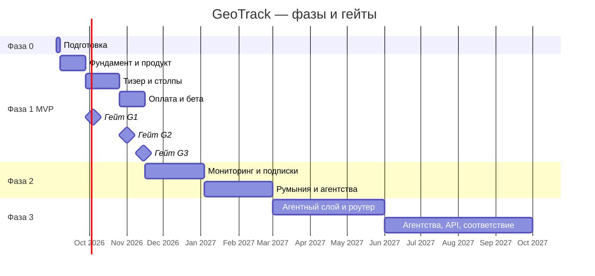

# GeoTrack — детальный роудмэп на 12 месяцев

Дата: 2026-09-03. Версия 1.0. Проект: GEO. Автор: Serghey (ProDuck:t Space) при участии Claude. Связанные документы: GEOTRACK_PRODUCT_CONCEPT_RU.md (v1.1), GEOTRACK_SALES_STRATEGY_RU.md, GEOTRACK_AUDIT_METHODOLOGY_RU.md, GEOTRACK_MVP_AND_ARCHITECTURE_RU.md, GEOTRACK_DESIGN_BRIEF_RU.md.

## Резюме

Роудмэп сводит все документы проекта в один календарь на 12 месяцев: подготовительная неделя, MVP за 10 недель с тремя гейтами, фаза мониторинга и подписок до конца февраля 2027 и фаза платформы до сентября 2027. Каждый этап расписан по пяти трекам — продукт и разработка, дизайн, продажи и контент, услуги ProDuck:t Space, методология и данные — с целями, метриками и условиями перехода.

**Ключевые предположения**:
- Команда — Serghey как продакт и Claude Code как разработчик; 20–25 часов в неделю на продукт и 10–15 на продажи.
- Решения по концепции v1.1 приняты: GeoTrack, английский и румынский, ProDuck:t Space исполняет услуги, цена $79 и $199, без публичного индекса; фаза 1 — только B2B SaaS.
- Финансирование первых шести месяцев — собственные средства и выручка; раунд обсуждается после гейта G3 с метриками MVP.

**Рекомендация**: старт недели 1 — понедельник 7 сентября 2026; не сдвигать гейты ради функций, сдвигать функции ради гейтов.

**Статус**: готово к использованию; даты после гейта G3 — ориентировочные.

---

## 1. Горизонты

| Горизонт | Период | Цель | Условие перехода |
|---|---|---|---|
| Фаза 0. Подготовка | 4–6 сентября 2026 | Закрыть решения и заявки, которые нельзя сделать параллельно | Решение по e-commerce, заявка в Paddle, домен, репозиторий |
| Фаза 1. MVP | 7 сентября – 15 ноября 2026, 10 недель | Автоматический тизер и платный аудит, первые 30 платных аудитов, три кейса, пакет для инвесторов | Гейт G3 |
| Фаза 2. Подписки и рынок | 16 ноября 2026 – 28 февраля 2027, 15 недель | Мониторинг и рекуррентная выручка, румынский рынок, результат ценового теста, первые агентства, раунд | 10 подписок, $10 000 выручки за фазу, решение по раунду |
| Фаза 3. Платформа | 1 марта – 30 сентября 2027 | Агентный слой, роутер моделей, white-label для агентств, API, соответствие требованиям mid-market | Выручка от агентств и услуг сопоставима с аудитами |

Порядок фаз задан выручкой и риском: сначала доказать, что аудит покупают и услуги продаются, потом сделать выручку рекуррентной, потом масштабировать через агентства и API.

Растровая копия диаграммы — `diagrams/GEOTRACK_ROADMAP_GANTT.png`.

---

## 2. Треки

Один человек ведёт пять треков, поэтому у каждого — своя доля недели и своё «минимально достаточное» на каждой фазе.

| Трек | Часов в неделю | Фаза 1 | Фаза 2 | Фаза 3 |
|---|---|---|---|---|
| Продукт и разработка (с Claude Code) | 20–25 | Тизер, платный аудит, оплата | Мониторинг, подписки, кабинет | Агентный слой, роутер, API |
| Дизайн (с Claude Design) | 2–3 | Дизайн-система, лендинг, отчёт | Дашборд мониторинга, кабинет | White-label, партнёрский кабинет |
| Продажи и контент | 10–15 | Личная сеть, аутрич по двум категориям | Румыния, агентства, LinkedIn | Партнёрская программа |
| Услуги ProDuck:t Space | 3–5, затем по заказам | Три услуги, регламенты, первые заказы | Каталог до восьми услуг | Методика для white-label |
| Методология и данные | 2–3 | Калибровка на 50 сайтах | Бенчмарки категорий, eval моделей | Веса v2, конкурентная разведка |

Итого 37–51 час в неделю в фазе 1 — это полная занятость. Если доступного времени меньше, первым сокращается трек продаж в неделях 1–4 (там продукт важнее), а не наоборот.

---

## 3. Фаза 0. Подготовка, 4–6 сентября

Три дня на то, что блокирует старт и не делается параллельно:

- Принять решение по e-commerce в фазе 1 (рекомендация — не брать); от него зависят таксономия и генератор промптов.
- Подать заявку в Paddle (запасной вариант — Lemon Squeezy); подтвердить юридическое лицо и реквизиты для выплат в Молдову.
- Зарегистрировать домен (варианты geotrack.ai, geotrack.app, getgeotrack.com) и почтовый домен для писем.
- Создать монорепозиторий, положить в него все пять документов проекта, черновик CLAUDE.md и папку `docs/specs`.
- Запустить промпт 6.1 из ТЗ на дизайн (дизайн-система) в Claude Design, чтобы токены были готовы к неделе 2.
- Составить список 10 компаний из личной сети для concierge-аудитов и двух стартовых категорий SaaS для аутрича.

---

## 4. Фаза 1. MVP по неделям

Каждая неделя — четыре строки: продукт, дизайн, продажи и услуги, критерий недели. Даты — понедельник начала недели.

### 4.1 Недели 1–4: до гейта G1

| Неделя | Продукт (Claude Code) | Дизайн, продажи, услуги | Критерий недели |
|---|---|---|---|
| 1 — 7 сентября | Фундамент: Next.js с next-intl, Supabase, Inngest, воркер на Railway, CI, Sentry, PostHog, Langfuse; схема данных v1 с локалью; адаптеры движков и малой модели с учётом стоимости; CLAUDE.md и первые спецификации | Дизайн: токены и компоненты из промпта 6.1. Продажи: ручные concierge-аудиты по методологии для трёх сайтов из сети — первые артефакты и замер времени по шагам | Пустой аудит проходит от события до записи в базу; стоимость вызова видна |
| 2 — 14 сентября | Краулер (3 и 50 страниц), паспорт продукта, таксономия из 200 категорий, детекция категории с уверенностью и окно выбора, конкуренты, генератор промптов на en и ro | Дизайн: лендинг (промпт 6.2). Продажи: ещё три concierge-аудита, первое письмо в Telegram о запуске. Услуги: регламент AI Crawl Fix | Категория верна в 85% на 20 тестовых сайтах; промпты прошли ручную проверку |
| 3 — 21 сентября | Технический чек B1–B6 с правилами блокеров; кэш категорий; опрос Perplexity; парсинг упоминаний; предварительный скор | Дизайн: окно категории и экран прогресса (6.3). Продажи: выбор двух категорий для аутрича, список 40 компаний. Услуги: регламент Citable Content Pack | Тизер за минуту и дешевле $0,1 на втором сайте категории; B воспроизводим дважды |
| 4 — 28 сентября | Лендинг, форма с Turnstile, экран прогресса, страница результата тизера, три шаблонные находки, шареабельная карточка, email через magic link, письмо результата, лимиты по домену; румынская версия интерфейса | Дизайн: результат тизера и карточка (6.4). Продажи: первые 30 тизеров по личной сети, разбор обратной связи | Гейт G1 |

**Гейт G1 (4 октября): тизер снаружи.** Критерии: 30 реальных тизеров, воронка видна в PostHog, себестоимость тизера ниже $0,15, минимум 10 собранных email, ни одного аудита с пустым столпом B. Если G1 не пройден — неделя 5 уходит на доработку, остальной план сдвигается.

### 4.2 Недели 5–8: до гейта G2

| Неделя | Продукт (Claude Code) | Дизайн, продажи, услуги | Критерий недели |
|---|---|---|---|
| 5 — 5 октября | Адаптеры ChatGPT и Gemini; 30 промптов, два повтора, доверительный интервал; точность описания A5, тональность A6 | Дизайн: полный отчёт и карточка находки (6.5). Продажи: старт аутрича по первой категории — 15 писем с готовыми тизерами | Столп A согласован с ручным аудитом на пяти эталонных сайтах |
| 6 — 12 октября | Анализ источников цитирования; контент-анализ C1–C6 на 10 страницах со сравнением с цитируемыми | Продажи: аутрич по второй категории; первый пост-разбор категории в LinkedIn. Услуги: регламент Entity Kit; три услуги готовы к продаже | Карта источников строится для 100% аудитов; C даёт баллы и артефакты |
| 7 — 19 октября | Столп D по D1, D2, D4 через SerpAPI; столп E: axe-core, барьеры, машиночитаемые данные, манифесты, скриптовые сценарии «найти цену» и «начать регистрацию» | Дизайн: корзина, оплата, цены (6.6). Продажи: первые созвоны с теми, кто открыл отчёт. Услуги: коммерческое предложение для первого ручного заказа | Полный аудит укладывается в 6 минут и $6 |
| 8 — 26 октября | Находки семи полей, приоритизация, корзина исправлений с прогнозом, веб-отчёт по токену, PDF, оплата через Paddle с вебхуками, три услуги в корзине, письма готовности и через сутки, румынский отчёт | Продажи: продажа первых платных аудитов вручную по $79 участникам беты. Услуги: первый оплаченный заказ | Гейт G2 |

**Гейт G2 (1 ноября): платный аудит доставляется автоматически.** Критерии: пять оплаченных аудитов, отчёт проходит ручную проверку в админке без правок текста в половине случаев, PDF собирается, хотя бы один заказ услуги, себестоимость полного аудита ниже $6.

### 4.3 Недели 9–10: до гейта G3

| Неделя | Продукт (Claude Code) | Дизайн, продажи, услуги | Критерий недели |
|---|---|---|---|
| 9 — 2 ноября | Калибровка: прогон 50 сайтов в двух категориях, правка весов, порогов и шаблонов находок; бенчмарки категорий в отчёте; проверка румынской версии на пяти сайтах; страница методологии; юридические страницы | Дизайн: языковой переключатель, письма, PDF, методология (6.7). Продажи: запуск последовательного ценового теста ($79 три недели, затем $49) | Разброс скора при повторе в пределах интервала; румынская версия проверена |
| 10 — 9 ноября | Бета: 20 concierge-клиентов, исправления по обратной связи; дашборд метрик воронки и себестоимости; демо-сценарий на две минуты | Продажи: три кейса с согласием на публикацию; лист ожидания мониторинга. Услуги: ре-аудит после первой исполненной услуги | Гейт G3 |

**Гейт G3 (15 ноября): пакет для инвесторов.** Критерии: не менее 300 тизеров и 30 платных аудитов накопленным итогом, конверсия тизера в оплату не ниже 5%, attach rate услуг не ниже 10%, три кейса, себестоимость аудита и тизера в цели, лист ожидания мониторинга от 30 компаний. Пакет: метрики за шесть недель, кейсы, демо, финансовая модель на 12 месяцев, план фазы 2.

---

## 5. Фаза 2. Подписки и рынок, 16 ноября 2026 – 28 февраля 2027

Цель фазы — превратить разовую выручку в рекуррентную и открыть румынский рынок как второй домашний.

| Период | Продукт | Продажи и услуги | Результат |
|---|---|---|---|
| 16 ноября – 20 декабря | Мониторинг: расписание прогонов, динамика скора и share of voice, алерты в email; подписки Monitor Starter и Growth через Paddle; кабинет с проектами; экспорт в Notion и Linear | Итоги ценового теста, фиксация цены; конвертация листа ожидания в подписки; каталог услуг до шести | 10 подписок; выручка декабря от $4 000 |
| 21 декабря – 3 января | Стабилизация, техдолг, тесты; переход на Temporal, если расписания и ре-аудиты не укладываются в Inngest | Пауза в аутриче; подготовка материалов для Румынии | Аптайм и стоимость под контролем |
| 4 января – 31 января | Столп D полностью (D3, D5), движок Copilot, локальные промпты для румынского рынка, бенчмарки категорий из накопленных данных | Румыния: пять агентств и два акселератора, аутрич по двум румынским категориям SaaS; первый воркшоп GEO | 10 румынских клиентов; первое агентство-партнёр |
| 1 февраля – 28 февраля | Роутер моделей с eval на золотых наборах; сравнение Gemini Flash и DeepSeek через американского провайдера; ClickHouse для временных рядов | Раунд: встречи с инвесторами на метриках фаз 1–2; решение по e-commerce на данных | Себестоимость тизера ниже $0,10; решение по раунду |

Условия перехода в фазу 3: не менее 10 активных подписок, $10 000 выручки за фазу, хотя бы одно агентство, готовое покупать white-label, понятная себестоимость и аптайм.

---

## 6. Фаза 3. Платформа, 1 марта – 30 сентября 2027

| Период | Продукт | Продажи и услуги | Результат |
|---|---|---|---|
| Март – май | Агентный слой: LLM-агент в Browserbase, четыре сценария, трассы, проверки MCP, WebMCP, ACP, UCP, Web Bot Auth, подтверждение владения доменом; услуги MCP Server Build и Agent UX Fix | Агентный аудит как дифференциатор в контенте и аутриче; первый инженер с продакшен-опытом на консультациях | Столп E автоматизирован |
| Июнь – июль | Организации и роли, агентский тариф, white-label отчёты, партнёрский кабинет, выплаты партнёрам; публичный API с ключами и вебхуками | Продажа интеграций и методики агентствам; первые пять white-label клиентов; найм человека на операции услуг | Выручка от агентств сопоставима с аудитами |
| Август – сентябрь | Регион данных ЕС, DPA, аудит-лог, SSO, наблюдаемость, подготовка к SOC 2 Type 1; конкурентная разведка как продукт | Первые сделки mid-market по тёплым входам; решение о «GeoTrack for Shopify» на данных фазы 2 | Продажи mid-market без блокеров по безопасности |

---

## 7. Метрики по фазам

| Метрика | Гейт G3, 15 ноября 2026 | Конец фазы 2, февраль 2027 | Конец фазы 3, сентябрь 2027 |
|---|---|---|---|
| Тизеров накопленным итогом | 300 | 1 500 | 6 000 |
| Платных аудитов накопленным итогом | 30 | 150 | 600 |
| Конверсия тизера в оплату | 5% и выше | 7% | 8% |
| Активных подписок мониторинга | лист ожидания 30 | 10 | 60 |
| Attach rate услуг | 10% | 15% | 20% |
| Выручка за период | $3 000–4 000 | $10 000–14 000 | $60 000–90 000 |
| Себестоимость тизера и аудита | $0,15 и $6 | $0,10 и $4 | $0,07 и $3 |
| Клиенты, чей скор вырос на балл и больше за 90 дней | 3 кейса | 30% платных | 40% платных |

Цифры фаз 2 и 3 — гипотезы, пересматриваются на каждом гейте.

---

## 8. Ресурсы и бюджет

Время: фаза 1 требует 37–51 час в неделю продакта; Claude Code работает столько, сколько задач поставлено. Деньги в фазе 1: инфраструктура (Vercel, Railway, Supabase, Upstash, Inngest) $100–200 в месяц; API движков и моделей $150–400 в месяц при 300 тизерах и 30 аудитах; SerpAPI или DataForSEO $50–100; Resend, Sentry, PostHog, Langfuse на бесплатных или стартовых тарифах $0–80; домен и почта $30; Claude Code и Claude Design по подписке. Итого $400–800 в месяц без учёта комиссии Paddle (около 5% плюс фиксированная часть за транзакцию). В фазе 2 добавляются ClickHouse Cloud и Temporal Cloud ($100–200), в фазе 3 — Browserbase и первые выплаты людям.

---

## 9. Риски и триггеры пересмотра

| Риск | Сигнал | Действие |
|---|---|---|
| Категория определяется плохо, промпты нерелевантны | Окно выбора категории показывается чаще чем в 40% аудитов | Расширить таксономию, поднять модель для шага 2, добавить поле категории на форму как обязательное |
| Конверсия тизера в оплату ниже 3% на G3 | Данные PostHog за шесть недель | Проблема в отчёте или цене, не в каналах: сначала чинить продукт, затем ценовой тест |
| Услуги не покупают | Attach rate ниже 5% при 30 аудитах | Переупаковать корзину: одна услуга «сделаем всё за $X» вместо трёх, созвон после каждого аудита |
| Изменение API или цен движков | Ошибки адаптеров, рост себестоимости выше $8 | Переключить движок в конфигурации, включить лимит стоимости, обновить методологию |
| Времени продакта не хватает | Две недели подряд без закрытого критерия недели | Заморозить трек продаж на две недели, сократить скоуп недели, не двигать гейт |
| Задержка Paddle | Нет одобрения к неделе 6 | Lemon Squeezy как запасной, ручные счета для первых пяти клиентов |
| Технический долг без человеческого ревью | Регрессии на еженедельном прогоне эталонных сайтов | Неделя стабилизации, консультация инженера, усиление тестов |

---

## 10. Что нужно решить до старта

1. E-commerce в фазе 1 — нет или да; рекомендация — нет.
2. Домен и написание бренда в интерфейсе: GeoTrack.
3. Юридическое лицо и реквизиты для Paddle или Lemon Squeezy.
4. Кто делает румынские тексты интерфейса и отчёта: Serghey сам или переводчик на проверку машинного перевода.
5. Две стартовые категории SaaS и 10 компаний для concierge-аудитов.

---

## 11. Выводы

Роудмэп держится на трёх гейтах фазы 1, и правило одно: гейты не двигаются, двигается скоуп. К 15 ноября 2026 у GeoTrack должны быть работающий тизер и платный аудит на английском и румынском, 30 платных клиентов, три кейса и пакет метрик для инвесторов. Фаза 2 делает выручку рекуррентной и открывает Румынию, фаза 3 превращает продукт в платформу для агентств. Следующий шаг — закрыть пять пунктов раздела 10 до понедельника 7 сентября.

---

**Статус**: готово к использованию; даты фаз 2 и 3 — ориентировочные  
**Последнее обновление**: 3 сентября 2026  
**Следующий пересмотр**: на гейте G1, 4 октября 2026
